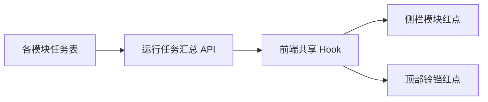

# 生成中红点技术方案

## 目标

红点仅表示用户在对应模块存在仍在生成的任务，不表示未读结果。用户刷新、退出或重新登录后，后端任务仍为运行状态时红点继续显示；任务完成或失败后自动消失。

## 状态规则

| 任务状态 | 红点 |
| --- | --- |
| `pending`、`processing` | 显示 |
| `completed`、`failed`、`partial_completed` | 不显示 |

`partial_completed` 表示已产生部分结果，不属于加载状态，避免历史图文任务误触发红点。

## 架构



- 后端接口：`GET /api/me/generation-notifications/running-summary`
- 返回：`totalRunningCount` 与按 `sourceType` 聚合的 `runningCount`
- 游客返回空摘要，不显示红点。
- 前端只有一个共享轮询：页面可见时每 10 秒请求一次；回到前台且距上次请求超过 30 秒时立即刷新。
- 切换账号时先清空内存摘要，再加载新账号摘要，避免短暂显示前一账号的状态。

## 查询与性能

接口通过受控的任务表白名单，以 `UNION ALL` 分别统计各模块：

```sql
SELECT 'video' AS source_type, COUNT(*) AS running_count
FROM video_generation_tasks
WHERE user_id = ? AND status IN ('pending', 'processing');
```

每张参与汇总的任务表都建立 `(user_id, status)` 联合索引，使统计只扫描当前用户的运行状态记录。索引由 `backend/src/scripts/initDb.js` 增量创建。

该方案不新增完成通知表，也不在任务完成时额外写库；任务表本身是唯一状态来源，因此跨设备、刷新和重新登录时状态保持一致。

## 扩展模块

新增模块时仅需：

1. 将任务表、`sourceType` 与运行状态加入 `generationNotification.repository.js` 的受控列表。
2. 在前端 `notificationSourcesForNav` 映射该 `sourceType` 到导航入口。
3. 确认任务表包含 `(user_id, status)` 联合索引。

无需新增模块级 React 状态、单独轮询或完成回调。
