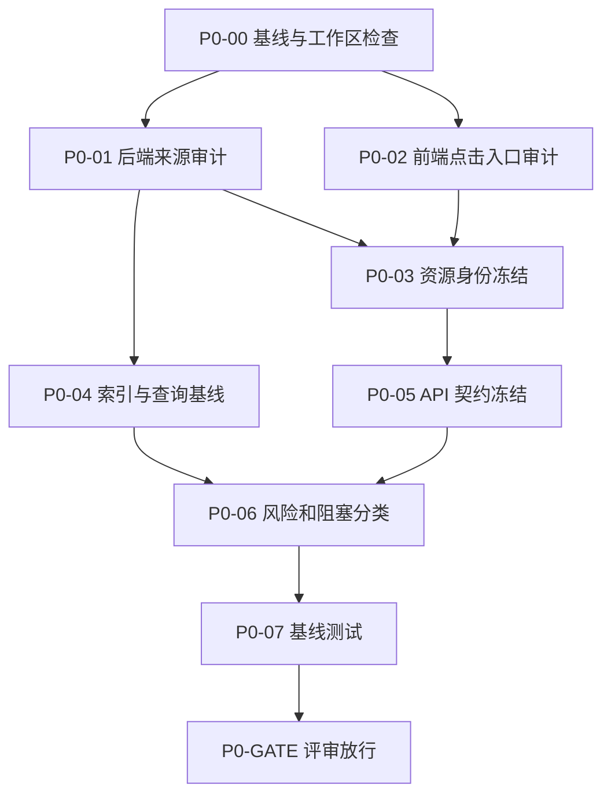

# 全站生成结果未读系统 P0 阶段改造文档

## 1. P0 的职责

P0 是“审计与契约冻结”阶段，不实现红点、不创建回执表、不修改业务接口。它负责把后续开发依赖的事实全部核验清楚，避免多个线程按不同理解开发后返工。

P0 结束时必须回答以下问题：

1. 哪些模块真正存在可持久化的历史结果？
2. 每个模块以哪张表或哪个聚合实体作为成功事实源？
3. 什么条件同时满足时，结果才算“成功且可查看”？
4. 用户看到的一张卡片对应哪个稳定 `resourceKey`？
5. 哪个前端 handler 是“点击卡片查看结果”的唯一入口？
6. 哪些内层按钮不能触发已读？
7. 当前索引是否能支撑按用户、状态和启用时间统计？
8. 哪些模块必须先做持久化或身份模型改造，不能直接接入？
9. 每个来源的未读是否都落在用户实际可访问的历史窗口内？

P0 只允许产生以下变更：

- P0 审计文档及矩阵。
- API fixture 或测试数据说明。
- SQL `SHOW INDEX` / `EXPLAIN` 审计结果。
- 后续任务所需的文件归属清单。

P0 禁止：

- 修改任务成功回调。
- 创建 `generation_result_reads`。
- 给业务返回值增加 `isUnread`。
- 在前端提前绘制红点。
- 使用 localStorage 临时模拟已读。
- 为尚未验证的查询直接增加索引。

本轮新增执行边界：

- 数字人和图片数字人的后端数据源、identity、Adapter 与接口契约允许审计和后续实现。
- 数字人前端历史入口数量、卡片红点、点击已读暂不实现。
- 在数字人前端恢复前，生产 `GENERATION_UNREAD_SOURCES` 不得包含 `digital-human` 或 `image-digital-human`，避免产生用户不可见且无法消费的未读。

## 2. P0 输入与输出

### 2.1 输入

- 总计划：`GENERATION_RESULT_UNREAD_TECHNICAL_DEVELOPMENT_PLAN.md`
- 数据库建表入口：`backend/src/scripts/initDb.js`
- 当前运行中通知：`backend/src/modules/generation-notification/`
- 全站导航：`frontend-app/src/layouts/navigation.js`
- 全站顶部栏：`frontend-app/src/layouts/WorkbenchTopbar.jsx`
- 全站功能容器：`frontend-app/src/app/ImageFeaturePage.jsx`
- 各模块 repository、service、mapper、历史 View 和现有测试。

### 2.2 输出

P0 必须提交五份明确产物：

| 产物 | 形式 | 用途 |
| --- | --- | --- |
| P0-R1 来源矩阵 | 本文第 7 章 | 后端 Adapter 的唯一依据 |
| P0-R2 点击入口矩阵 | 本文第 8 章 | 前端接入的唯一依据 |
| P0-R3 索引基线 | 本文第 9 章 | 决定阶段 1 是否补索引 |
| P0-R4 API 契约 | 本文第 10 章 | 冻结前后端字段与错误语义 |
| P0-R5 阻塞与放行表 | 本文第 11 章 | 决定各模块是否允许进入实现 |

## 3. P0 工单执行顺序



可并行关系：

- P0-01 后端审计与 P0-02 前端审计可以并行。
- P0-03 必须等待同一模块的后端和前端审计都完成。
- P0-04 可在后端来源审计完成后独立执行。
- P0-05、P0-06 必须由主线统一收口，不能由业务线程分别定义。

## 4. 详细工单

### P0-00：基线与工作区检查

目标：保证审计基于当前真实代码和可连接数据库，同时不覆盖已有修改。

步骤：

1. 执行 `git status --short`，记录已有改动；P0 不清理、不重置其他人的文件。
2. 在 `backend` 执行 `npm run db:check`，只确认连接和数据库名，不输出密码、Token 或完整环境变量。
3. 记录当前前后端基线命令：后端 `npm test`，前端 `npm run test:unit` 和定向 route smoke。
4. 确认 `generation_result_reads` 尚不存在；如果环境中已经存在，记录来源和表结构，禁止直接覆盖。
5. 确认当前 `/api/me/generation-notifications/running-summary` 契约并保存匿名用户、登录用户的结构样例。

当前核验结果：

- 数据库连接检查通过，数据库为 `jingchuang_ai`。
- `generation_result_reads` 在当前数据库中不存在，P0 未执行任何 DDL/DML。
- 现有 running summary 只统计运行中任务，不存储或返回已读状态。
- 当前分支为 `fix`，审计基线提交为 `80d285c4`。
- 当前工作区没有被 P0 修改的业务代码；仅新增本系列技术文档，已有文件保持不变。

完成条件：

- 数据库可审计或明确记录不可用原因。
- 已有用户改动被记录并保持不变。
- 基线命令和现有通知契约有可复查记录。

### P0-01：后端来源审计

目标：为每一个 source 确定唯一数据源、成功状态、结果可用条件、用户归属和时间字段。

每个模块必须执行：

1. 从 routes 定位历史列表/详情 controller。
2. 从 controller 定位 service 列表函数。
3. 从 service 定位 mapper 和 repository 查询。
4. 核验 repository 查询必带 `user_id`。
5. 核验 mapper 真实输出的 id、status、result URL、createdAt。
6. 核验删除、收藏或重新生成是否改变 `updated_at`，避免后续误用更新时间作为启用边界。
7. 核验“成功但无结果 URL”的异常行是否可能出现。
8. 把结果填写到第 7 章，不允许只写模块名称。

按代码区域拆分：

| 审计包 | 后端文件范围 | 必须确认 |
| --- | --- | --- |
| P0-01A 图片 | `modules/image/image.repository.js`、`image.service.js`、`image.mapper.js` | `source` 隔离、result_urls 格式、单任务是否一张卡 |
| P0-01B 视频 | `modules/video/video.repository.js`、`video.service.js`、`video.mapper.js` | `source` 隔离、实际视频结果字段 |
| P0-01C 图文 | `modules/article/article.repository.js`、`article.service.js` | package 与子图关联、懒状态更新、legacy 记录 |
| P0-01D 数字人 | `modules/digital-human/`、`modules/image-digital-human/` | 两类任务独立 identity、导航聚合 |
| P0-01E 视频工作流 | `modules/motion-transfer/`、`modules/face-swap/` | 完成结果字段、共享前端但后端分表 |
| P0-01F 营销工具 | `modules/watermark/`、`remove-bg/`、`enhance/` | 图片/视频类型不改变任务粒度 |
| P0-01G 音频 | `modules/music/`、`voice/`、`voice-convert/` | 有 status 与无 status 表的差异 |
| P0-01H 文本 | `modules/transcribe/`、`replicate/` | 空文本、completed_with_warning |
| P0-01I 特殊 | `modules/video-dub/`、`canvas/` | 内存任务、节点到底层任务映射 |

完成条件：第 7 章每行的“仍需核验”均有明确结论或进入阻塞表。

### P0-02：前端点击入口审计

目标：找到用户主动查看历史结果的唯一入口，区分真正点击与自动展示。

每个模块必须执行：

1. 从历史入口按钮追踪到历史列表组件。
2. 找到卡片主媒体/主按钮的 handler。
3. 找到预览弹窗、播放器或文本详情的打开函数。
4. 列出卡片内的收藏、下载、删除、重新生成 handler。
5. 检查父卡片是否绑定 `onClick`，内层操作是否 `stopPropagation`。
6. 检查 Enter/Space 键盘激活是否走同一 handler。
7. 检查页面初始化是否自动选中最新结果。
8. 检查播放器恢复、自动播放或原生 controls 是否会触发相同事件。

重点文件：

| 模块 | 入口/容器 | 历史卡片或主查看文件 |
| --- | --- | --- |
| 图片 | `ImageGenerationView.jsx` | `ImageGenerationWorkbench.jsx`、`ImageGalleryContent.jsx`、`imageSharedUi.jsx` |
| 视频 | `VideoGenerationView.jsx` | `VideoGenerationContent.jsx`、`VideoCards.jsx` |
| 爆款图文 | `WorkbenchTopbar.jsx`、`ArticleGenerationView.jsx` | `ArticleHistoryGrid.jsx`、`ArticleHistoryPreviewDialog.jsx` |
| 数字人 | `WorkbenchTopbar.jsx`、`DigitalHumanHubView.jsx` | `DigitalHumanHistoryView.jsx`；仅做 P0 只读审计，后续前端实现暂缓 |
| 动作/换脸 | `WorkbenchTopbar.jsx`、`VideoGenerationWorkflow.jsx` | `video-workflow/components/HistoryPanel.jsx` |
| 去水印 | `WatermarkRemovalView.jsx` | 同文件历史卡片区域 |
| 抠图 | `RemoveBgView.jsx` | 同文件历史卡片区域 |
| 画质提升 | `EnhanceView.jsx` | 同文件历史卡片区域 |
| 音乐 | `MusicGenerationView.jsx` | `MusicRecentGrid.jsx`、`MusicFullPagePlayer.jsx` |
| 语音合成 | `VoiceSynthesisView.jsx` | `audio-ui/VoiceRecentPlayer.jsx` |
| 音色转换 | `VoiceConvertView.jsx` | `audio-ui/VoiceRecentPlayer.jsx` |
| 转写 | `TranscribeView.jsx` | 同文件历史选择区域 |
| 反推提示词 | `ReplicateView.jsx` | 同文件历史选择区域 |
| 视频配音 | `VideoDubbingView.jsx` | `VideoCard` 内播放按钮 |
| 无限画布 | `canvas-app/src/views/Canvas.vue` | 节点结果组件及 store，需继续定位 |

完成条件：第 8 章每个放行模块都有一个 `mark read trigger` 和一个明确的 `do not mark` 列表。

### P0-03：资源身份冻结

目标：保证汇总、历史列表和标记接口使用完全相同的卡片 identity。

统一格式：

```json
{
  "sourceType": "article",
  "resourceKey": "package-123"
}
```

检查规则：

1. `sourceType` 必须是服务端静态常量，最长 40 个 ASCII 字符。
2. `resourceKey` 必须从已归属当前用户的服务端记录生成。
3. 普通一任务一卡模块使用业务表主键的字符串形式，不使用 provider_task_id。
4. 图文 package 必须使用 `package-{id}`，不能使用任一子图片 task id。
5. 数字人两张表分别使用两个 sourceType，即使前端入口合并。
6. 无限画布在完成节点身份审计前不冻结 resourceKey。
7. 视频配音在数据库主键方案确定前不冻结 resourceKey。
8. 图片工作台是明确例外：有 `thread_id` 时使用 `thread-{thread_id}`，没有时使用 `task-{id}`；同一 thread 的任务共享一个未读身份。

冻结的 V1 sourceType：

```text
image
video
article
digital-human
image-digital-human
motion
face-swap
watermark
remove-bg
enhance
music
voice
voice-convert
transcribe
replicate
```

暂不放行：

```text
video-dub
infinite-canvas-image
infinite-canvas-video
```

数字人两个 sourceType 已冻结，但属于“后端可实现、生产来源关闭、前端暂缓”，不在上述 identity 阻塞列表中。

完成条件：同一卡片在 summary、history mapper 和 mark-read verifier 中能生成逐字一致的 identity。

### P0-04：索引与查询基线

目标：确认现有数据结构能否支撑“当前用户 + source 独立启用时间 + 最新 20 张卡 + 成功/可读 + 无回执”的查询。

执行内容：

1. 查询 `INFORMATION_SCHEMA.STATISTICS`，记录真实数据库索引，不只阅读 initDb。
2. 对每个来源执行不带回执表的 source-side `EXPLAIN`。
3. 阶段 1 创建回执表后，再对完整“窗口子查询 + `NOT EXISTS` / `LEFT JOIN`”执行第二次 EXPLAIN。
4. 测试数据量过小时，不能因为 `rows=1` 就判断索引一定合理；必须关注候选 key、实际 key 和 Extra。
5. P0 只产出索引建议，索引修改归 DB-02。

安全执行要求：

- 使用参数化 userId 和 cutoff。
- 不输出用户 ID、提示词、结果 URL或环境密钥。
- 不执行更新或删除 SQL。
- 不用生产大表做无边界查询。

当前实库基线见第 9 章。

完成条件：每个放行 source 都有“可继续使用”或“DB-02 需补索引”的结论。

### P0-05：API 契约冻结

目标：让后端、公共前端和业务线程不需要自行猜字段。

冻结内容：

- 历史 item 统一字段。
- Summary 响应结构。
- Mark-read 请求与 204 响应。
- 游客、非法 source、非本人资源、接口故障语义。
- 严格布尔判断方式。

详细契约见第 10 章。

完成条件：五份 fixture 被评审通过，后续契约变更必须走主线评审。

### P0-06：阻塞与放行分类

目标：防止“所有模块”被误解为所有模块必须在同一时刻强行实现。

分类：

- `READY`：数据持久化、identity、结果可用条件、主动点击入口都明确。
- `READY_WITH_CHANGE`：主体明确，但接入前需增加一个明确的小改动，例如给共享 HistoryPanel 增加主查看 handler。
- `BLOCKED_PERSISTENCE`：任务不持久化，重启后无法保持状态。
- `BLOCKED_IDENTITY`：一张可见卡片无法稳定映射到资源键。
- `OUT_OF_SCOPE`：不属于生成结果未读。

完成条件：第 11 章所有模块恰好属于一个分类，且阻塞项有后续任务 ID。

### P0-07：基线测试

目标：证明后续出现的回归来自改造，而不是改造前已失败。

执行命令：

```text
cd backend
npm test

cd frontend-app
npm run test:unit
npx playwright test tests/route-smoke.spec.js
npx playwright test tests/infinite-canvas.spec.js
npm run build
```

记录要求：

- 记录命令、日期、通过/失败数量。
- 失败时记录首个真实错误和是否与未读功能无关。
- 不为了让 P0 通过而顺手修改无关业务代码；另建缺陷任务。

完成条件：基线全部通过，或每个既有失败都有明确 owner 和不阻塞理由。

## 5. P0 文件归属

即使 P0 使用多线程审计，也要保持文件唯一写入者：

| 文件/区域 | 写入者 | 其他线程权限 |
| --- | --- | --- |
| 本 P0 文档 | 主线 | 只发送审计结论，不直接同时编辑 |
| 总技术计划 | 主线 | 只在 Gate 后同步链接/结论 |
| backend 业务模块 | P0 只读 | 不允许修改 |
| frontend 业务模块 | P0 只读 | 不允许修改 |
| initDb/config | P0 只读 | 不允许修改 |
| 数据库 | 只读查询 | 禁止 DDL/DML |

## 6. 审计判定规范

### 6.1 “成功”不等于“可查看”

必须同时满足：

```text
属于当前用户
创建时间在启用边界之后
任务业务状态成功，或该表只在成功后落库
结果字段确实存在且非空
记录未被删除
```

例外：

- 爆款图文以 package 是否至少拥有一张 completed 且有 URL 的子图为准，不依赖 package 懒更新后的 status。
- replicate 的 `completed_with_warning` 有文本结果时可查看。
- voice/voice-convert/transcribe 没有 status 列，记录存在并不自动充分，还要校验结果字段。

### 6.2 来源时间边界必须使用 created_at

V1 使用 `created_at >= sourceEnabledAt`，每个 source 独立保存首次启用时间，并禁止使用 `updated_at`，原因：

- 收藏切换可能更新 `updated_at`。
- 状态懒刷新可能更新 `updated_at`。
- 元数据修复可能更新 `updated_at`。
- 使用更新时间会让上线前旧记录意外变成未读。
- 使用单个全局 enabledAt 无法支持分批启用；后开启来源会回填大量旧记录，推进时间又会破坏先启用来源的未读。

### 6.3 未读必须落在可消费窗口

- V1 每个 source 只跟踪按历史卡 identity 排序后的最新 20 张卡。
- 必须先取最新 20 张历史卡，再判断 readable；不能先过滤成功后取 20，否则 processing/failed 卡会改变用户实际可见窗口。
- 窗口外历史 item 固定返回 `isUnread: false`，无需补写回执。
- 当前所有接入模块必须至少能展示这 20 张卡；否则该来源不得启用。
- 窗口基于当前未删除记录动态计算；删除较新卡后较旧卡可能进入窗口并按回执重新判定。这一行为必须测试，V1 不为窗口外记录写批量过期回执。

### 6.4 一张卡片只能有一个 identity

- 一任务一卡片：任务表主键。
- 图片历史 thread 卡：`thread-{thread_id}`；无 thread 的 fallback 为 `task-{id}`。
- 多子任务一卡片：上层聚合实体主键。
- 一个任务在多个派生页面出现：仍共享源模块 identity，派生页面不创建第二条未读。
- 导航合并只合并数量，不合并 resource identity。

## 7. P0-R1 后端来源矩阵

状态说明：`核验完成` 表示当前代码足以冻结；`需 P0 补查` 表示必须在 P0-GATE 前定位；`阶段 6 阻塞` 表示不允许进入普通接入批次。

| Source | 事实源 | 用户/主键 | 成功且可查看条件 | 时间 | 列表入口 | P0 结论 |
| --- | --- | --- | --- | --- | --- | --- |
| `image` | `image_generation_tasks`，`source='image'` | `user_id` / `thread-{thread_id}`；无 thread 为 `task-{id}` | thread 内至少一项 `status='completed'` 且 `result_urls` 至少一个有效 URL | thread 内 `MAX(created_at)` | image listTasks | 核验完成；按历史 thread 卡去重，必须排除 article/canvas source |
| `video` | `video_generation_tasks`，`source='video'` | `user_id` / numeric `id` | `completed` 且存在可播放结果 URL | `created_at` | video listTasks | 核验完成；必须排除 canvas source |
| `article` | `article_generation_packages` + article image tasks | package `user_id` / `package-{id}` | package 下至少一张子任务 completed 且有图片 URL | package `created_at` | article listTasks/getPackage | 核验完成；不能只依赖 package.status；legacy 旧单图不放行 |
| `digital-human` | `digital_human_tasks` | `user_id` / numeric `id` | `completed` + `result_url` | `created_at` | listDigitalHumanTasks | 核验完成 |
| `image-digital-human` | `image_digital_human_tasks` | `user_id` / numeric `id` | `completed` + `result_url` | `created_at` | image DH tasks | 核验完成 |
| `motion` | `motion_transfer_tasks` | `user_id` / numeric `id` | `completed` + `result_url` | `created_at` | listMotionTransferTasks | 核验完成 |
| `face-swap` | `face_swap_tasks` | `user_id` / numeric `id` | `completed` + `result_url` | `created_at` | face swap tasks | 核验完成 |
| `watermark` | `watermark_tasks` | `user_id` / numeric `id` | `completed` + `result_url` | `created_at` | watermark tasks | 核验完成 |
| `remove-bg` | `remove_bg_tasks` | `user_id` / numeric `id` | `completed` + `result_url` | `created_at` | remove-bg tasks | 核验完成 |
| `enhance` | `enhance_tasks` | `user_id` / numeric `id` | `completed` + `result_url` | `created_at` | enhance tasks | 核验完成 |
| `music` | `music_tasks` | `user_id` / string `id` | `completed` + 非空 `audio_url` | `created_at` | getRecentMusic/getMusicTask | 核验完成；歌词同步状态不参与 |
| `voice` | `voice_synthesis_tasks` | `user_id` / string `id` | 记录存在 + 非空 `audio_url` | `created_at` | voice listTasks | 核验完成；表无 status |
| `voice-convert` | `voice_convert_tasks` | `user_id` / string `id` | 记录存在 + 非空 `audio_url` | `created_at` | voice-convert listTasks | 核验完成；表无 status |
| `transcribe` | `transcribe_tasks` | `user_id` / string `id` | `text` 或 `formatted_text` 非空 | `created_at` | getRecentTranscriptions | 核验完成；表无 status |
| `replicate` | `replicate_tasks` | `user_id` / string `id` | `completed/completed_with_warning` + prompt/description 非空 | `created_at` | recent/getTask | 核验完成 |
| `video-dub` | 服务内 `Map` | task 内 userId / string id | completed + result video | task 字段 | getTasks/getTask | 阶段 6 阻塞：没有数据库持久化 |
| infinite canvas | `canvas_node_tasks` + image/video task | project/user/node/task 混合 | 底层任务完成且节点结果可再次打开 | 多来源 | canvas service/store | 阶段 6 阻塞：卡片粒度和稳定 identity 待专项审计 |

逐字段核验结论：

- 图片 `mapImageTask()` 解析 `result_urls`，以 `image`/`imageUrl` 暴露结果；普通图片必须额外限定 `source='image'`，不能把 article 或 canvas 任务重复计数。
- 视频 `mapVideoTask()` 解析 `result_urls`，可播放字段是 `video: urls[0]`；普通视频必须限定 `source='video'`。
- 去水印、抠图、增强的 mapper 都只把持久化后的 `row.result_url` 暴露为 `resultUrl`。完成回调先将 provider 结果本地化，再写 `result_url`；因此 `completed + 非空 result_url` 是安全条件，不能拿 provider 临时 URL 兜底计数。
- 反推提示词 mapper 将 `prompt` 和 `description` 规范化为 `""`；只有 `completed/completed_with_warning` 且两者至少一个 `trim()` 后非空才算可查看。
- image、music、voice、voice-convert、transcribe、replicate、两类数字人的部分 mapper 会把时间格式化为展示字符串。公共装饰器不得从 item 判断资格；必须调用 source Adapter 的批量 repository SQL，直接使用原始 `created_at`、sourceEnabledAt 和 20 卡窗口返回 readable resource keys，再查询回执。
- 部分旧模块 repository 通过 AsyncLocalStorage 的 `getCurrentExternalId()` 限定用户。新 summary 与 mark-read verifier 必须显式接收 `req.user.id`，不得新增隐式或全局可变用户身份。

## 8. P0-R2 前端点击入口矩阵

| Source/模块 | 历史入口 | 主查看触发器 | 不应标记已读 | 当前缺口 |
| --- | --- | --- | --- | --- |
| image | 图片页历史/图库 | 历史线程：`ImageGenerationWorkbench.jsx:274 onSelect(thread.id)`；单图：`:173 onPreview(task)`、`imageSharedUi.jsx:47/53 onPreview(card)`；父级当前传入 `setPreviewTask` | 收藏、删除、重新生成、下载、生成完成后自动展示 | 接入时用统一 wrapper；同 thread 所有 item 共享一个 identity 和红点 |
| video | 视频历史列表 | `VideoCards.jsx:17 onOpen(task)` → `VideoGenerationContent.jsx:246 setSelectedHistoryTask` | 下载、收藏、删除、重新生成、灵感示例 | 唯一历史播放器入口已定位，可直接包装 |
| article | 顶部“历史图文” | `ArticleHistoryGrid.jsx:24 onPreview(task)` → `ArticleGenerationView.jsx:803 setPreviewTask` | 收藏、重新生成、删除、生成完成后自动展示 | package 作为一张卡；入口数字由 Topbar 接收 nav 聚合 |
| digital-human | 顶部“历史记录” | `DigitalHumanHistoryView.jsx:272-275` 的媒体按钮，完成态执行 `setPreviewTask(task)` | resume、下载、删除、重新生成、弹窗内自动播放 | 仅记录；后续前端改造 DEFERRED，不修改组件、不启用生产来源 |
| motion/face-swap | 顶部历史切换 | 当前不存在统一主查看 handler；`HistoryPanel.jsx:30-36` 只有原生 `<video controls>` | 收藏、下载、重复生成、删除、原生 `play` 事件 | `READY_WITH_CHANGE`：给 `HistoryPanel` 增加显式 `onOpen(task)`，不得监听媒体播放事件推断已读 |
| watermark | 页面历史区域 | 当前不存在；`WatermarkTaskCard` 只渲染图片或原生 video controls | 收藏、下载、删除、重复生成、原生 `play` | `READY_WITH_CHANGE`：新增显式结果预览 `onOpen(task)` |
| remove-bg | 页面历史区域 | 当前不存在；`RemoveBgTaskCard` 只渲染结果图片 | 收藏、下载、删除、重复生成 | `READY_WITH_CHANGE`：新增显式结果预览 `onOpen(task)` |
| enhance | 页面历史区域 | 当前不存在；`EnhanceTaskCard` 只渲染图片或原生 video controls | 收藏、下载、删除、重复生成、原生 `play` | `READY_WITH_CHANGE`：新增显式结果预览 `onOpen(task)` |
| music | 最近音乐/历史歌曲 | 历史打开：`MusicGenerationView.jsx:584 openCompletedPlayer(item)`；播放器列表切歌：`:604 selectPlayerTrack(item)` | 下载、收藏、歌词后台同步、播放器恢复/自动播放 | 两个都是显式用户选择；共享同一幂等 wrapper，只有 `isUnread === true` 才发请求 |
| voice | 最近生成卡 | `VoiceRecentPlayer.jsx:64 togglePlay()` 中从暂停到播放的分支；父级位于 `VoiceSynthesisView` | 下载、收藏、删除、暂停、拖动进度、自动播放 | 共享播放器增加 `onUserPlay(playerId)`；父级用 `sourceType=voice` 绑定 identity |
| voice-convert | 最近转换卡 | 与 voice 共用 `VoiceRecentPlayer.jsx:64 togglePlay()`；父级位于 `VoiceConvertView` | 下载、收藏、删除、暂停、拖动进度、自动播放 | 同一回调但父级绑定 `sourceType=voice-convert` |
| transcribe | 历史列表 | 当前不存在；`TranscribeView.jsx:391-411` 卡片直接展示文本，只有复制/下载/删除 | 复制、下载、删除、进入历史页后自动渲染 | `READY_WITH_CHANGE`：增加显式卡片/详情打开动作，只有该动作标记已读 |
| replicate | 历史列表 | 当前不存在生成文本详情入口；`ReplicateView.jsx:350 setLightboxOpen(true)` 仅放大输入图片 | 复制、下载、输入媒体预览、原生视频 controls、生成完成自动展示 | `READY_WITH_CHANGE`：增加生成结果详情打开动作；输入素材预览不得标记结果已读 |
| video-dub | 视频卡播放按钮 | `VideoCard.onPlay(item)` | 下载、收藏、删除 | UI 明确，但后端持久化阻塞 |
| canvas | 未冻结 | 未冻结 | 页面加载、节点可见、项目恢复 | `BLOCKED_IDENTITY` |

### 8.1 图片历史线程的消费规则

图片工作台的一张历史条目可能是一个 thread，`buildImageHistoryThreads()` 会把多个任务 id 放入 `thread.ids`。为了让“入口数量、红点数量、回执数量”与可见卡片一致，冻结以下规则：

1. 有 `thread_id` 的任务统一使用 `resourceKey=thread-{thread_id}`；无 thread 的任务使用 `task-{id}`。
2. summary 对 thread 去重，一张历史 thread 卡最多贡献 1；同 thread 的 API item 返回相同 `resourceKey/isUnread`。
3. 点击线程条目或线程内任一结果图，只发送一次该 thread identity 的 mark-read，不逐 task 发送。
4. 乐观清除同 identity 的全部可见红点；POST 失败时恢复这些 item 和汇总计数，允许再次点击。
5. 生成完成后的自动选中、恢复会话和页面首次渲染均不消费未读。

## 9. P0-R3 索引基线

### 9.1 实库已存在索引

本次通过只读 `INFORMATION_SCHEMA.STATISTICS` 核验，不仅依赖建表脚本。

| 数据源 | 与未读查询相关的现有索引 | P0 初步结论 |
| --- | --- | --- |
| image | `(user_id,status)`、`(source,user_id,created_at)`、`(user_id,thread_id,created_at)` | 索引分别覆盖条件但未形成 source+user+status+time 完整联合；需代表数据量复测 |
| video | `(user_id,status)`、`(source,user_id,created_at)` | 同上，需复测 source 过滤 |
| article package | `(user_id,status)`、`(user_id,created_at)`、`(user_id,thread_id)` | package 主查询可用；子图 EXISTS 需完整 SQL 后复测 |
| digital-human | `(user_id,status)`、`(user_id,created_at)` | 初步可用 |
| image-digital-human | `(user_id,status)`、`(user_id,created_at)` | 初步可用 |
| motion | `(user_id,status)`、`(user_id,created_at)`、单 status | 初步可用，但优化器在小数据量选择单 status，需复测 |
| face-swap | `(user_id,status)`、`(user_id,created_at)`、单 status | 同上 |
| watermark | `(user_id,status)`、`(user_id,created_at)` | 初步可用 |
| remove-bg | `(user_id,status)`、`(user_id,created_at)` | 初步可用 |
| enhance | `(user_id,status)`、`(user_id,created_at)` | 初步可用 |
| music | `(user_id,status)`、`(user_id,created_at)` | 初步可用 |
| voice | `(user_id,created_at)` | 与无 status 成功表匹配 |
| voice-convert | `(user_id,created_at)` | 与无 status 成功表匹配 |
| transcribe | `(user_id,created_at)` | 与无 status 成功表匹配 |
| replicate | `(user_id,status)`、`(user_id,created_at)` | 初步可用 |
| canvas_node_tasks | `(project_id,user_id,created_at)`、唯一项目/节点/类型/任务 | 不适合直接做用户级未读汇总；身份先阻塞 |

### 9.2 当前 EXPLAIN 观察

本次使用匿名化 user 参数和固定 cutoff，对修正后的“先取最新 20 卡，再判断 readable”source-side 查询执行真实 `EXPLAIN`。没有输出用户 ID、业务文本、URL 或环境密钥。

可复现查询形态：

```sql
SELECT id
FROM (
  SELECT id, status, result_url
  FROM <静态白名单任务表>
  WHERE user_id = ? AND created_at >= ?
  ORDER BY created_at DESC, id DESC
  LIMIT 20
) recent
WHERE status = 'completed' AND result_url IS NOT NULL AND result_url <> '';
```

图片使用 `IF(thread_id IS NULL OR thread_id='', CONCAT('task-',id), CONCAT('thread-',thread_id))` 分组，取 `MAX(created_at), MAX(id)` 排序并以聚合 readable 条件判定；图文先取最新 20 个 package，再通过同用户、`source='article'`、相同 `thread_id` 的 completed 子图 `EXISTS` 判定。

实际计划摘要：

| 查询族 | 内层实际 key | 估算 rows | 关键 Extra | 结论 |
| --- | --- | ---: | --- | --- |
| image thread window | `idx_image_tasks_user_created` | 1 | `Using where; Using temporary; Using filesort` | thread 聚合会临时排序；DB-02 必须用代表数据复测 |
| video window | `idx_video_tasks_user_created` | 1 | `Using where; Backward index scan` | 当前可继续；完整回执查询后复测 source 选择性 |
| article package + child EXISTS | package: `idx_article_packages_user_created`；child: `idx_image_tasks_thread` | 1 / 2 | package backward scan；child `FirstMatch` | 连接路径明确；完整 `NOT EXISTS` 后复测 |
| status + result_url（motion 代表） | `idx_motion_tasks_user_created` | 1 | `Backward index scan` | 同结构来源可继续，仍需代表数据验证 |
| 无 status 成功表（voice 代表） | `idx_voice_synthesis_user_created` | 1 | `Backward index scan` | 现有索引匹配窗口查询 |
| replicate text window | `idx_replicate_user_created` | 1 | `Backward index scan` | 现有索引匹配窗口查询 |

当前数据量很小，`rows=1/2` 不能证明生产规模性能；这些记录只证明查询形态和候选 key 可执行，不替代 DB-02 的代表数据复测。

P0 索引建议：

1. P0 不新增索引。
2. DB-02 在创建回执表并加入窗口子查询与 `NOT EXISTS` 后重新 EXPLAIN，记录 `key/rows/Extra`。
3. image/video 优先评估 `(user_id,source,created_at,id)` 或与实际选择性相符的等价顺序；image thread 聚合另外观察临时表与 filesort 成本。
4. 普通任务表优先复测 `(user_id,created_at,id)`；`status` 在最新 20 卡窗口外层判断，不能把 status 放到时间之前而改变“先取窗口”的产品语义。
5. 所有新增索引先查重复和前缀覆盖，避免索引膨胀。

## 10. P0-R4 API 契约

### 10.1 历史 item

所有已接入历史 list/get 返回：

```json
{
  "id": "123",
  "sourceType": "music",
  "resourceKey": "123",
  "status": "completed",
  "isUnread": true
}
```

规则：

- `sourceType/resourceKey` 必须由后端生成。
- `isUnread` 必须始终存在且为 boolean；功能关闭、非成功、结果不可用或降级时返回 false。
- 无 status 的成功落库表可以保持原响应不增加虚假 status；上例 status 不是所有模块强制新增字段。
- 前端只使用 `item.isUnread === true`。

### 10.2 Summary

```http
GET /api/me/generation-notifications/summary
```

```json
{
  "totalRunningCount": 1,
  "totalUnreadCount": 3,
  "unreadAvailable": true,
  "bySource": {
    "image": { "runningCount": 1, "unreadCount": 2 },
    "article": { "runningCount": 0, "unreadCount": 1 }
  },
  "generatedAt": "2026-08-07T08:00:00.000Z"
}
```

规则：

- 数字人和无限画布的导航合并发生在前端 selector，不改变 bySource 原始身份。
- total 是 source 原始计数之和，不重复加入 nav 聚合。
- 游客返回全零。
- 旧 `/running-summary` 保持 running-only repository/service 调用链，不得触碰回执表或未读 Adapter。
- 任一未读来源失败时，新 summary 仍返回准确 running、`unreadAvailable: false` 和全零 unread；禁止返回部分未读总数。

### 10.3 Mark read

```http
POST /api/me/generation-notifications/results/read
Content-Type: application/json
```

```json
{
  "sourceType": "article",
  "resourceKey": "package-123"
}
```

响应：

- 成功写入：204。
- 已经读过：204。
- 资源不存在、非本人、未成功、source 启用时间前或已离开最新 20 卡窗口：204 且不写入。
- sourceType/格式非法：400。
- 未登录：使用现有登录校验响应。
- 数据库异常：5xx；前端吞掉该旁路错误，不影响主查看动作。

### 10.4 Fixture

P0 必须冻结五份 fixture 语义：

```json
{
  "name": "completed-unread",
  "item": { "sourceType": "image", "resourceKey": "thread-image-abc", "isUnread": true }
}
```

```json
{
  "name": "completed-read",
  "item": { "sourceType": "image", "resourceKey": "thread-image-abc", "isUnread": false }
}
```

```json
{
  "name": "processing-never-unread",
  "item": { "sourceType": "image", "resourceKey": "thread-image-processing", "isUnread": false }
}
```

```json
{
  "name": "outside-window-never-unread",
  "item": { "sourceType": "voice", "resourceKey": "old-task", "isUnread": false }
}
```

```json
{
  "name": "unread-unavailable-keeps-running",
  "summary": {
    "totalRunningCount": 1,
    "totalUnreadCount": 0,
    "unreadAvailable": false,
    "bySource": { "image": { "runningCount": 1, "unreadCount": 0 } }
  }
}
```

## 11. P0-R5 阻塞与放行表

| 模块 | 分类 | 放行条件/后续任务 |
| --- | --- | --- |
| 图片 | READY | 结果字段、source 和线程消费语义已冻结；进入 IMG-BE/FE |
| 视频 | READY | `video` 结果字段及唯一播放器入口已冻结；进入 VID-BE/FE |
| 爆款图文 | READY_WITH_CHANGE | 使用子图 EXISTS 而非 package.status；进入 ART-BE |
| 数字人/图片数字人 | BACKEND_READY_FRONTEND_DEFERRED | 分 source 完成 DH-BE 和后端测试；不执行 DH-FE，生产来源保持关闭 |
| 动作迁移/视频换脸 | READY_WITH_CHANGE | HistoryPanel 增加明确主查看 handler；进入对应 BE/WORKFLOW-FE |
| 去水印/抠图/增强 | READY_WITH_CHANGE | 当前没有主查看函数；营销批次先增加显式 `onOpen(task)`，再绑定已读 |
| 音乐 | READY_WITH_CHANGE | 防止播放器双入口重复；进入 MUSIC-BE/FE |
| 语音合成/音色转换 | READY_WITH_CHANGE | 共享播放器增加 identity 回调；进入 VOICE 工单 |
| 转写/反推提示词 | READY_WITH_CHANGE | 当前没有生成结果详情入口；先增加显式用户打开动作，自动渲染不算已读 |
| 视频配音 | BLOCKED_PERSISTENCE | 先完成 VDUB-DB、VDUB-REPO |
| 无限画布 | BLOCKED_IDENTITY | 先完成 CANVAS-AUDIT |
| 大模型聊天 | OUT_OF_SCOPE | 单独会话未读项目，不进入本计划 |
| 我的资产/收藏/账单 | OUT_OF_SCOPE | 不重复产生源结果未读 |

## 12. P0-GATE 验收清单

以下所有项目必须勾选后才能开始 DB-01/BE-01/FE-01：

- [x] P0-00 基线测试与工作区检查完成。
- [x] 第 7 章所有 READY 模块的真实结果字段已核验。
- [x] 图片/视频的 source 过滤规则已核验。
- [x] 每来源独立启用时间和最新 20 卡可消费窗口已冻结。
- [x] 图片 identity 已修正为 thread 卡粒度，入口数量、红点和回执一一对应。
- [x] 爆款图文 package identity 和子图 EXISTS 条件已冻结。
- [x] 第 8 章所有 READY/READY_WITH_CHANGE 模块已有精确 handler，或明确记录“当前无 handler”及接入前置动作。
- [x] 所有内层按钮的“不标记已读”规则已记录。
- [x] 自动展示、自动选择、自动播放路径已与用户点击区分。
- [x] POST 失败的卡片/汇总回滚和重试语义已冻结。
- [x] 旧 running-summary 与未读故障域已隔离。
- [x] 第 9 章索引基线完成，DB-02 候选索引有证据。
- [x] 第 10 章 API fixture 语义已冻结。
- [x] 视频配音和无限画布没有被误放入普通批次。
- [x] 数字人后端/前端边界已确认：允许 DH-BE，禁止本轮 DH-FE，生产来源关闭。
- [x] 后端 `npm test` 基线已执行，既有失败已登记。
- [x] 前端 unit、route smoke、canvas 和 build 基线已执行，既有失败已登记。
- [x] 公共文件和业务模块采用主线唯一写入；当前不拆分业务分支，后续按阶段文件边界执行。

### 12.1 P0-07 基线执行记录

执行时间：`2026-08-07T15:49:48+08:00`。

| 检查 | 结果 | 既有问题/结论 |
| --- | --- | --- |
| `backend/npm run db:check` | 通过 | 可连接 `jingchuang_ai`；未发现 `generation_result_reads` |
| `backend/npm test` | 90/92 通过 | 2 个测试因工作区未安装已在 package/lock 声明的 `cos-nodejs-sdk-v5` 而无法加载；登记为 `P0-ENV-01` |
| `frontend-app/npm run test:unit` | 15/15 通过 | 无失败 |
| route smoke | 未启动 | 工作区未安装已在 package/lock 声明的 `@playwright/test`；登记为 `P0-ENV-02` |
| infinite canvas | 未启动 | 与 route smoke 相同，登记为 `P0-ENV-02` |
| `frontend-app/npm run build` | 预检失败 | 既有 `videoDurationPicker.css` 动画缺少 reduced-motion 规则；登记为 `P0-FE-A11Y-01` |

这些问题都在未读业务代码改动前复现，不阻塞 P0 契约冻结。`P0-ENV-01/02` 必须在阶段 1 验证前恢复依赖；`P0-FE-A11Y-01` 不属于本需求，不在 P0 顺手修改，但最终发布 Gate 必须处理或获得独立豁免。

责任归属：`P0-ENV-01/02` 由主线在阶段 1 首次测试前处理；`P0-FE-A11Y-01` 归前端公共样式维护任务，未读改造只记录基线，不修改该 CSS。

### 12.2 P0-GATE 结论

```text
P0 状态：PASS
放行来源：image,video,article,motion,face-swap,watermark,remove-bg,enhance,music,voice,voice-convert,transcribe,replicate
后端可接入但前端暂缓：digital-human,image-digital-human
阻塞来源：video-dub,infinite-canvas-image,infinite-canvas-video
DB-02 候选索引：image/video 复测 user+source+created_at+id；普通任务表复测 user+created_at+id；仅凭代表数据 EXPLAIN 决定是否新增
冻结补充：每来源 enabledAt；最新 20 卡窗口；image thread identity；失败立即回滚；running-only 兼容接口
既有测试失败：P0-ENV-01、P0-ENV-02、P0-FE-A11Y-01
阶段 1 可以启动：是，但必须由用户明确批准下一阶段后再执行
执行/评审：Codex 主线
评审时间：2026-08-07T15:49:48+08:00
```

### 12.3 Review 修订记录

复审修订时间：`2026-08-07T16:18:18+08:00`。

- 用每来源 `sourceEnabledAt` 替代单一全局启用时间，支持安全分批放量。
- 冻结最新 20 张历史卡窗口，避免 summary 产生用户无法访问和消费的未读。
- 图片由 task identity 修正为 thread 卡 identity；无 thread 时使用 task fallback。
- mark-read POST 失败立即回滚卡片与汇总，轮询只负责最终校准。
- 旧 `/running-summary` 保持 running-only；新 summary 用 `unreadAvailable` 隔离未读故障。
- 历史装饰资格由 Adapter 原始 SQL 判断，不解析 mapper 展示时间。
- Adapter 改为静态 SQL fragment，由公共 repository 一次 `UNION ALL` 执行。
- 已补充窗口查询的真实、匿名化 EXPLAIN 形态和 `key/rows/Extra` 摘要。

上述修订完成后 P0 维持 `PASS`；业务代码、数据库和运行配置仍未修改。

## 13. P0 完成定义

P0 不是“文档写完”就完成。只有满足以下条件才算完成：

1. 所有 READY 模块都能从数据库记录追踪到 API item，再追踪到用户主点击 handler；READY_WITH_CHANGE 模块已明确记录当前缺失入口和唯一前置改动。
2. 每个 identity 的生成规则唯一且可由服务端验证用户归属。
3. 所有成功条件同时包含业务状态与结果可用性，不只判断 completed 字符串。
4. 旧数据边界固定使用 created_at，且每来源 sourceEnabledAt 契约已冻结。
5. 索引建议来自实库索引和 EXPLAIN，不来自猜测。
6. 两个特殊模块的阻塞被明确保留，没有临时浏览器方案。
7. P0 基线测试结果可复现。
8. P0-GATE 被明确标记 PASS 后，后续改造才开始。
9. 每个未读计数都对应最新 20 卡窗口内用户可访问的卡片，不产生无法消费的隐藏未读。
