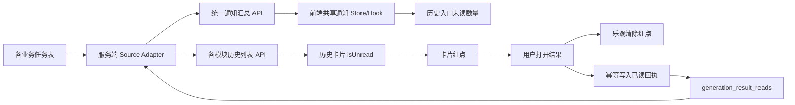
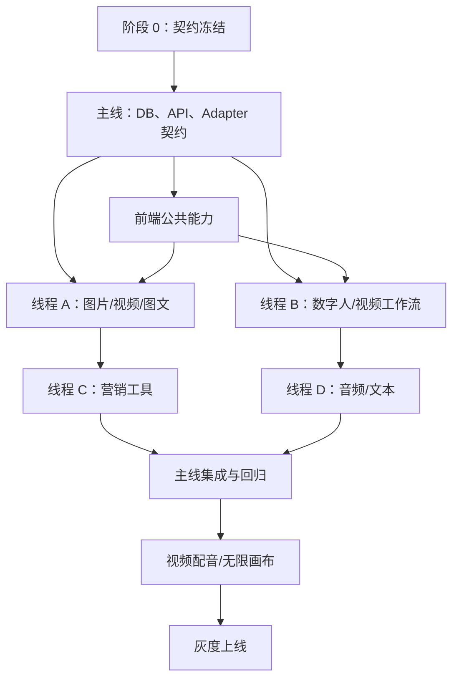

# 全站生成结果未读系统技术开发文档

## 1. 文档目标

本文档定义 Facemini 全站“生成成功但尚未查看”能力的技术方案、阶段门禁、模块拆分、并行开发方式、测试标准、灰度与回滚方案。

最终采用以下最小事实模型：

```text
原业务任务表 = 生成结果与成功状态的唯一事实来源
generation_result_reads = 用户已经查看过某个结果的唯一事实来源
成功且不存在已读回执 = 未读
```

本方案不新建“成功通知流水表”，不要求各模块在成功回调中双写通知数据，避免任务表与通知表之间的数据不一致。

## 2. 产品规则冻结

以下规则是所有开发任务的共同契约，开发过程中不得由单个模块自行改变：

1. 未读统计单位是用户在历史区域看到的“一张结果卡片”，不是底层供应商任务数；图片工作台按持久化 `thread_id` 聚合为一张历史卡。
2. 只有已经产生可查看结果的卡片才可能未读；运行中、失败、已删除记录不计入未读。
3. 只有后端明确返回布尔值 `isUnread: true` 才表示未读；`false`、`null`、字段缺失和其他值一律按已读处理。
4. 用户触发卡片的主查看动作即视为已读。图片/视频是打开预览，音乐/语音是播放，文本结果是打开或展开详情。
5. 收藏、下载、删除、重新生成及卡片操作菜单不算查看，不得因事件冒泡误标已读。
6. 点击未读卡片时，原查看动作优先执行；标记已读是独立旁路请求，失败不能阻断预览、播放等原业务动作。
7. 点击已读卡片不再请求标记接口；标记请求失败时必须回滚该 identity 的卡片和汇总乐观状态，使用户可以再次点击重试。
8. 进入历史页面不批量清空未读，必须逐卡查看。
9. 当前生成工作台自动展示结果不算已读；只有用户从历史卡片触发主查看动作才写回执。
10. 爆款图文按套餐卡片统计。套餐第一次出现可预览图片后可成为未读；查看一次后，剩余子图片完成不再次提醒。
11. 反推提示词的 `completed_with_warning` 视为有可查看结果。
12. 上线前旧历史默认已读；每个 source 使用自己的首次启用时间，只统计该 source 启用后创建的记录。
13. 未读数量展示上限为 `99+`，服务端仍返回真实整数。
14. 游客不产生回执、不显示未读数量；登录用户之间的数据完全隔离。
15. V1 每个 source 只跟踪当前未删除历史中的最新 20 张卡；窗口之外当前不参与未读且不显示红点，保证所有计数都有用户可点击的对应卡片。

## 3. 范围与非范围

### 3.1 V1 纳入范围

- 图片生成
- 视频生成
- 爆款图文
- 数字人视频后端能力，包括模板数字人和图片数字人的 Adapter、资源校验和接口装饰；数字人前端展示与点击已读暂缓，生产来源保持关闭
- 动作迁移
- 视频换脸
- 去水印
- 智能抠图
- 画质提升
- AI 音乐
- 语音合成
- 音色转换
- 语音转文字
- 反推提示词
- 视频配音（完成持久化前置任务后接入）
- 无限画布（以实际历史卡片或可再次打开的结果节点为边界单独接入）

### 3.2 V1 不纳入范围

- 大模型聊天会话。聊天属于会话阅读语义，不直接套用生成任务未读。
- 我的资产、收藏、账单等派生视图。它们不重复生成未读，只展示源模块结果。
- 浏览器系统通知、声音提醒、短信或邮件通知。
- 批量“全部已读”。
- 按一张卡片内部的每一张图片分别统计未读。
- WebSocket 实时推送。V1 复用现有共享轮询与主动刷新。

## 4. 总体架构



核心约束：

- 成功事实始终来自原任务表，不复制。
- 已读事实始终来自回执表，不在各业务表重复增加 `read_at`。
- 所有动态来源必须通过服务端白名单适配器，禁止客户端传入表名、状态或用户 ID。
- 历史列表一次性批量装饰 `isUnread`，禁止逐卡请求，避免 N+1。

## 5. 数据模型

### 5.1 已读回执表

建议在 `backend/src/scripts/initDb.js` 中增量创建：

```sql
CREATE TABLE IF NOT EXISTS generation_result_reads (
  id BIGINT UNSIGNED NOT NULL AUTO_INCREMENT PRIMARY KEY,
  user_id BIGINT UNSIGNED NOT NULL,
  source_type VARCHAR(40) CHARACTER SET ascii COLLATE ascii_bin NOT NULL,
  resource_key VARCHAR(191) CHARACTER SET ascii COLLATE ascii_bin NOT NULL,
  read_at TIMESTAMP NOT NULL DEFAULT CURRENT_TIMESTAMP,
  UNIQUE KEY uq_generation_result_read (user_id, source_type, resource_key),
  INDEX idx_generation_result_reads_user_source (user_id, source_type, read_at),
  CONSTRAINT fk_generation_result_reads_user
    FOREIGN KEY (user_id) REFERENCES users(id) ON DELETE CASCADE
) ENGINE=InnoDB DEFAULT CHARSET=utf8mb4 COLLATE=utf8mb4_unicode_ci;
```

设计说明：

- 不保存 `is_unread`，避免布尔值与 `read_at` 矛盾。
- `source_type + resource_key` 是模块内资源身份；加上 `user_id` 后形成用户级唯一回执。
- `resource_key` 只允许服务端适配器认可的 ASCII 标识，最大长度 191。
- 重复点击通过唯一键保证幂等，`read_at` 保留第一次查看时间，不重复刷新。
- 删除业务任务后允许保留少量孤立回执；汇总以业务任务表为左表，因此不会产生错误未读。后续可增加低优先级清理任务，但不属于 V1 必需项。

### 5.2 统一资源身份

公共类型：

```ts
type GenerationResultIdentity = {
  sourceType: string;
  resourceKey: string;
};
```

规则：

- 普通任务：`resourceKey = String(task.id)`。
- 图片历史：有 `thread_id` 时 `resourceKey = thread-${thread_id}`，无 thread 时 `resourceKey = task-${task.id}`。
- 爆款图文套餐：`resourceKey = package-${packageId}`。
- 同一导航下存在两类任务时，使用不同 `sourceType`，在展示汇总层再按导航聚合。
- 禁止使用供应商 `provider_task_id` 作为公共身份，因为其格式、生命周期和唯一性由外部平台控制。

### 5.3 按来源启用时间与可消费窗口

新增配置：

```text
GENERATION_UNREAD_SOURCES=image,video,article,...
GENERATION_UNREAD_SOURCE_ENABLED_AT_JSON={"image":"2026-08-08T00:00:00.000Z","video":"2026-08-08T00:00:00.000Z"}
```

规则：

- source 只有同时出现在 `GENERATION_UNREAD_SOURCES`、服务端静态白名单和时间 JSON 中，且时间是合法 UTC ISO-8601，才算启用。
- 内部配置使用 `Map<sourceType, Date>`；每个 source 只统计 `created_at >= sourceEnabledAt` 的任务，旧历史默认已读。
- 分批扩大来源时只为新 source 写入自己的未来启用时间，禁止修改已经启用来源的时间。
- 使用固定 UTC 时间，所有 SQL 参数化传入，不在模块代码中写死时间。
- 上线前创建、上线后才完成的在途任务在 V1 中不提醒，这是为避免历史回填和误报接受的明确边界。
- V1 固定 `UNREAD_HISTORY_WINDOW_SIZE = 20`。窗口按当前未删除历史动态计算：每个 source 先按历史卡 identity 和 `created_at DESC, id DESC` 选择最新 20 张卡，再判断成功、结果可用和回执；禁止先过滤成功再取 20。
- 历史 list/get 对窗口外 item 一律返回 `isUnread: false`。所有接入页面必须能够展示最新 20 张卡；如果未来某页面低于该数量，必须同步降低该 source 的窗口或补分页后才能启用。
- 删除窗口内卡片后，下一张较旧但仍存在的卡会进入窗口，并按其回执重新计算；这是 V1 为避免新增分页/窗口状态表而接受的确定性规则，必须加入删除边界测试。
- 图片窗口按 thread 卡计数，爆款图文按 package 卡计数，其余 V1 来源按 task 卡计数。

## 6. 后端模块化设计

### 6.1 目录建议

在现有 `backend/src/modules/generation-notification/` 内扩展，不创建第二套通知模块：

```text
generation-notification/
  generationNotification.routes.js
  generationNotification.controller.js
  generationNotification.service.js
  generationNotification.repository.js
  generationResultRead.repository.js
  generationResultRead.service.js
  generationResultSources.js
  sources/
    image.source.js
    video.source.js
    article.source.js
    digitalHuman.source.js
    videoWorkflow.source.js
    marketingTools.source.js
    audio.source.js
    replicate.source.js
    canvas.source.js
```

每个 Source Adapter 只能暴露固定函数，禁止让上层拼接任意 SQL：

```ts
type GenerationResultSourceAdapter = {
  sourceType: string;
  navId: string;
  buildUnreadCountFragment(input: {
    userId: number;
    sourceEnabledAt: Date;
    windowSize: number;
  }): { sql: string; params: unknown[] };
  listReadableResourceKeys(input: {
    userId: number;
    resourceKeys: string[];
    sourceEnabledAt: Date;
    windowSize: number;
  }): Promise<Set<string>>;
  findOwnedReadableResource(
    userId: number,
    resourceKey: string,
    sourceEnabledAt: Date,
    windowSize: number
  ): Promise<boolean>;
};
```

`buildUnreadCountFragment` 只能返回模块内静态 SQL 模板和参数，公共 repository 负责用 `UNION ALL` 一次执行；Adapter 本身不得为 summary 单独发起查询。

历史列表 `isUnread` 装饰采用公共批处理辅助函数：

```ts
decorateGenerationResults({
  userId,
  sourceType,
  items,
  getResourceKey
})
```

该函数不使用 mapper 的展示状态或格式化时间判断资格。它先调用当前 source Adapter 的 `listReadableResourceKeys`，由 repository SQL 基于原始 `created_at`、最新 20 卡窗口、成功状态和结果字段返回可读 identity；再一次批量查询这些 identity 的回执，输出新对象且不修改模块原对象。整个列表最多增加两次批量查询，不允许逐卡 SQL。

```json
{
  "sourceType": "music",
  "resourceKey": "music-task-id",
  "isUnread": true
}
```

### 6.2 成功与“结果可查看”判定

不能只看字符串 `completed`，还必须验证结果字段存在，避免数据库状态已完成但媒体丢失时显示未读：

```text
普通异步媒体任务：status = completed 且 result_url/result_urls 非空
音乐：status = completed 且 audio_url 非空
语音合成：记录存在且 audio_url 非空
音色转换：记录存在且 audio_url 非空
转写：记录存在且 text 或 formatted_text 非空
反推提示词：status in (completed, completed_with_warning) 且 prompt/description 非空
爆款图文：套餐至少有一个 completed 子图片且图片 URL 非空
```

### 6.3 API 契约

#### 统一汇总

新增：

```http
GET /api/me/generation-notifications/summary
```

返回：

```json
{
  "totalRunningCount": 2,
  "totalUnreadCount": 5,
  "unreadAvailable": true,
  "bySource": {
    "image": { "runningCount": 1, "unreadCount": 2 },
    "video": { "runningCount": 0, "unreadCount": 1 },
    "music": { "runningCount": 1, "unreadCount": 2 }
  },
  "generatedAt": "2026-08-07T08:00:00.000Z"
}
```

兼容策略：

- 保留现有 `/running-summary` 的 running-only repository/service 路径；它不得查询回执表或未读 Adapter，确保未读故障不影响既有运行中红点。
- `bySource` 中没有记录的来源等价于两个计数均为 0。
- 游客返回全零摘要。
- 新 `/summary` 先独立取得 running 结果，再取得 unread 结果。任一未读来源或回执查询失败时，接口仍以 200 返回准确 running 数据、`unreadAvailable: false`、所有 `unreadCount: 0` 和 `totalUnreadCount: 0`；不返回部分未读总数。
- running 查询自身失败时沿用原接口错误语义；前端保留上一次完整成功快照。

#### 标记单条已读

新增：

```http
POST /api/me/generation-notifications/results/read
Content-Type: application/json
```

请求：

```json
{
  "sourceType": "music",
  "resourceKey": "music-task-id"
}
```

处理顺序：

1. 必须是登录用户；游客返回 401 或现有登录校验错误。
2. `sourceType` 必须命中启用来源和服务端 Adapter 白名单。
3. 验证 `resourceKey` 类型、长度和允许字符。
4. Adapter 验证资源属于当前用户、位于该 source 最新 20 卡窗口、处于可查看成功状态且在该 source 启用时间之后。
5. 验证失败时不透露资源是否属于其他用户；统一返回 204，不写回执。
6. 验证成功后 `INSERT ... ON DUPLICATE KEY UPDATE read_at = read_at`。
7. 成功与重复已读均返回 `204 No Content`。

安全约束：

- 请求体不得接受 `userId`、表名、状态或 SQL 字段。
- 所有数据库条件必须包含服务端会话中的 `user_id`。
- 不允许根据客户端传入的 `sourceType` 动态插入表名；只能从静态 Adapter Map 选择函数。
- 接口日志不记录媒体 URL、提示词、正文或鉴权信息。

### 6.4 汇总查询策略

- 继续使用受控来源白名单和 `UNION ALL` 思路，但把运行中和未读查询拆成清晰的 Adapter。
- 每个来源先从当前用户、source 启用时间后的记录中选出最新 20 张历史卡，再判断可查看成功状态。
- 通过 `NOT EXISTS` 或 `LEFT JOIN ... IS NULL` 排除回执；以 `EXPLAIN` 结果选择实际方案。
- 不允许先加载所有历史到 Node.js 再计数。
- 公共 repository 组合所有已启用 Adapter 的静态 fragment，并通过一次 `UNION ALL` 查询返回各 source 数量；禁止每来源一次 summary SQL。
- 未读窗口必须先按时间取卡，因此候选索引以 `(user_id, created_at, id)` 为基础；共表来源使用 `(user_id, source, created_at, id)` 或等价顺序。`status` 索引继续服务 running 查询，但不得放在未读窗口时间列之前改变取样语义。
- 无显式状态列的成功结果表使用 `(user_id, created_at)` 现有索引和非空结果条件。
- 爆款图文必须按 package 去重，不得按子图片计数。

## 7. 前端模块化设计

### 7.1 共享状态

扩展现有 `useGenerationNotifications`，建议对外暴露：

```ts
{
  summary,
  refresh,
  markReadOptimistically,
  getUnreadCountForNav
}
```

职责：

- 登录后加载一次统一汇总。
- 页面可见时沿用现有 10 秒轮询。
- 切换账号时先清空摘要，避免串号闪烁。
- `unreadAvailable === false` 时继续更新 running 状态，但隐藏全部未读数字和卡片红点。
- 标记已读时原子地把对应来源和总数各减一，最小为 0，并生成该 identity 的 rollback token。
- 标记请求失败不抛给卡片主流程；使用 rollback token 恢复卡片 `isUnread` 和汇总计数，允许用户再次点击。下一次 summary/list 刷新只负责最终校准，不替代回滚。
- 同一个 identity 在请求进行中只允许一次乐观扣减，防止双击减两次。
- 可选使用 `BroadcastChannel` 向同源标签页广播已读 identity；该能力可放在第二阶段，不阻塞 V1。

### 7.2 共享 API

```text
generationNotificationApi.getSummary()
generationNotificationApi.markResultRead({ sourceType, resourceKey })
```

`markResultRead` 的 Promise 只能由通知层捕获，业务预览函数不得 `await` 它。

### 7.3 共享 UI

建议增加两个无业务状态组件：

```text
GenerationUnreadBadge：历史入口数字，1～99 / 99+
GenerationUnreadDot：卡片右上角红点
```

要求：

- 数字角标和卡片红点都必须同时满足 `unreadAvailable === true`；不可用时即使旧 item 暂存 `isUnread: true` 也不渲染。
- 红点不遮挡主内容和卡片操作按钮。
- 数字角标有可访问文本，例如“5 条未读生成结果”。
- 仅颜色不能作为唯一信息；数字角标提供文本，卡片主按钮的 `aria-label` 追加“未读”。
- 在 `prefers-reduced-motion` 下不增加脉冲动画。
- 移动端不能因角标造成标签跳动或横向溢出。

### 7.4 公共打开包装器

各模块不直接复制请求逻辑，使用公共动作：

```ts
openGenerationResult({
  item,
  open,
  markRead
});
```

行为：

1. 先调用原 `open(item)`；如果它同步抛错，保持原错误语义且不标记。
2. `open` 已成功发起后，仅当 `item.isUnread === true` 时乐观更新同 identity 的全部可见卡片和汇总，并保存 rollback token。
3. fire-and-forget 调用标记接口：204 时提交乐观状态；请求失败时按 token 回滚并捕获异常，不影响已经发起的预览或播放。
4. 媒体加载、异步播放或详情拉取在用户点击之后失败，不撤销本次查看意图；只有 mark-read 请求自身失败才回滚未读状态。
5. 收藏、下载、删除等按钮保持原 handler，不调用该包装器并阻止冒泡。
6. 键盘 Enter/Space 触发主按钮时与鼠标行为一致。

## 8. 模块接入矩阵

下表是编码前必须由负责人逐项核验的基线；“成功条件”同时要求结果字段可用。

| Source Type | 导航/模块 | 原始数据源 | 资源键 | 成功条件 | 主查看动作 | 接入备注 |
| --- | --- | --- | --- | --- | --- | --- |
| `image` | 图片生成 | `image_generation_tasks`，`source='image'` | 有 thread：`thread-{thread_id}`；无 thread：`task-{id}` | thread 内至少一项 `completed` + `result_urls`；无 thread 时判断该任务 | 选择历史 thread 或打开其中图片 | 一张历史 thread 卡一个 identity；同 thread 的 item 共享 `isUnread` |
| `video` | 视频生成 | `video_generation_tasks`，`source='video'` | task id | `completed` + 视频 URL | 打开视频预览 | 一任务一卡片 |
| `article` | 爆款图文 | `article_generation_packages` + article 子图片 | `package-{id}` | 至少一张子图完成且有 URL | 打开套餐预览 | 按 package 去重；旧 legacy 单图默认不接入 V1 |
| `digital-human` | 模板数字人 | `digital_human_tasks` | task id | `completed` + `result_url` | 打开视频预览 | 与图片数字人在导航层聚合 |
| `image-digital-human` | 图片数字人 | `image_digital_human_tasks` | task id | `completed` + `result_url` | 打开视频预览 | 与模板数字人在导航层聚合 |
| `motion` | 动作迁移 | `motion_transfer_tasks` | task id | `completed` + `result_url` | 打开视频预览 | 复用视频工作流历史组件 |
| `face-swap` | 视频换脸 | `face_swap_tasks` | task id | `completed` + `result_url` | 打开视频预览 | 复用视频工作流历史组件 |
| `watermark` | 去水印 | `watermark_tasks` | task id | `completed` + `result_url` | 打开结果预览 | 图片/视频均按任务 |
| `remove-bg` | 智能抠图 | `remove_bg_tasks` | task id | `completed` + `result_url` | 打开图片预览 | 一任务一卡片 |
| `enhance` | 画质提升 | `enhance_tasks` | task id | `completed` + `result_url` | 打开结果预览 | 图片/视频均按任务 |
| `music` | AI 音乐 | `music_tasks` | task id | `completed` + `audio_url` | 点击卡片播放/打开播放器 | 播放按钮即主查看动作 |
| `voice` | 语音合成 | `voice_synthesis_tasks` | task id | 记录存在 + `audio_url` | 点击卡片播放 | 表只在成功后落库，无 status |
| `voice-convert` | 音色转换 | `voice_convert_tasks` | task id | 记录存在 + `audio_url` | 点击卡片播放 | 表只在成功后落库，无 status |
| `transcribe` | 语音转文字 | `transcribe_tasks` | task id | 记录存在 + 文本非空 | 打开/展开转写结果 | 表只在成功后落库，无 status |
| `replicate` | 反推提示词 | `replicate_tasks` | task id | `completed` 或 `completed_with_warning` + 文本结果 | 打开/选中结果 | 警告完成仍可读 |
| `video-dub` | 视频配音 | 当前进程内 `Map` | task id | `completed` + 结果视频 | 点击播放 | 必须先完成数据库持久化，否则重启后无法保证未读 |
| `infinite-canvas-image` | 无限画布图片节点 | 图片任务 + `source='infinite-canvas'` | 待节点模型核验 | 完成 + 图片结果 | 打开历史结果节点 | 不得把画布自动渲染视为点击 |
| `infinite-canvas-video` | 无限画布视频节点 | 视频任务 + `source='infinite-canvas'` | 待节点模型核验 | 完成 + 视频结果 | 打开历史结果节点 | 导航层合并为无限画布数量 |

导航聚合映射单独维护，不能改变资源身份：

```text
digital-human nav = digital-human + image-digital-human
infinite-canvas nav = infinite-canvas-image + infinite-canvas-video
```

## 9. 分阶段开发计划

### 阶段 0：契约冻结与基线审计

详细执行文档：`GENERATION_RESULT_UNREAD_P0_AUDIT_AND_CONTRACT.md`。阶段 0 的审计步骤、实库索引基线、来源/点击矩阵和 Gate 以该文档为准。

当前状态：`PASS`（2026-08-07 复审修订）。已补齐每来源启用时间、20 卡窗口、图片 thread identity、失败回滚、running 故障隔离、原始时间资格查询和单次 UNION 契约。只代表阶段 1 已具备启动条件；未获得用户下一阶段确认前不执行 DB-01/BE-01/FE-01。

目标：在任何业务代码改动前消除模块语义差异。

任务：

1. 确认接入矩阵中的数据表、成功状态、结果字段、资源键和主查看 handler。
2. 为每个模块记录历史列表 API、后端 mapper、前端卡片组件和测试文件。
3. 对现有任务索引执行 `SHOW INDEX` / `EXPLAIN` 基线记录。
4. 明确每个 source 的独立启用时间、20 卡可消费窗口、首批来源和灰度顺序。
5. 为视频配音创建独立的持久化前置任务，不把内存 Map 强行接入回执表。
6. 确认无限画布是否存在用户可主动打开的历史卡片；如果没有，暂不显示卡片红点，只保留后续接入点。

交付物：

- 最终接入矩阵。
- API JSON 契约样例。
- 查询性能基线。
- 模块负责人和文件归属表。

门禁：矩阵未确认的模块不得开始实现。

### 阶段 1：数据库与后端核心

目标：建立与业务模块无关的已读能力，功能开关保持关闭。

任务：

1. 增量创建 `generation_result_reads` 表、唯一键和外键。
2. 增加每来源启用时间、20 卡窗口与来源配置解析、校验和默认关闭逻辑。
3. 实现回执批量查询和幂等写入 repository。
4. 实现 Adapter 注册表和输入白名单。
5. 实现标记已读 service/controller/route。
6. 实现新的统一 summary 契约，并保持旧 running-summary 兼容。
7. 增加匿名用户、越权 resourceKey、重复点击、非法 sourceType 测试。
8. 验证迁移重复运行安全。

门禁：

- 功能关闭时所有现有接口行为不变。
- 重复标记已读不会新增多行或刷新首次 `read_at`。
- 用户 A 不能创建、查询或影响用户 B 的回执。
- 后端核心测试全部通过。

### 阶段 2：前端公共能力

目标：完成共享状态、API、数字角标和红点组件，不接业务模块。

任务：

1. 扩展 generation notification API。
2. 扩展共享 Hook/Store，支持 unread summary 和单 identity 乐观更新。
3. 实现请求中去重、POST 失败按 identity 回滚与后续 summary/list 最终校准。
4. 实现 `GenerationUnreadBadge` 和 `GenerationUnreadDot`。
5. 实现公共打开包装器。
6. 完成组件、Hook、账号切换和请求失败单元测试。
7. 确认现有“生成中红点”视觉与未读数字不混用。

门禁：公共组件通过桌面、移动端、键盘和 reduced-motion 验证。

### 阶段 3：第一批试点模块

模块：图片生成、视频生成、爆款图文。

原因：覆盖单图片、单视频和多子任务聚合三种代表模型，可以最早暴露架构问题。

每个模块的标准任务包：

1. Adapter 增加未读计数与资源归属验证。
2. 历史列表 mapper 批量补充 `sourceType/resourceKey/isUnread`。
3. 历史入口接入数字角标。
4. 卡片接入红点和主查看包装器。
5. 操作按钮阻止冒泡且不标记已读。
6. 补齐后端、前端和 Playwright 场景。
7. 记录 summary SQL 的执行计划和响应时间。

门禁：

- 两个未读逐个点击时数量 2 → 1 → 0。
- 刷新和重新登录后保持已读。
- 爆款图文四张子图只计一条。
- 标记接口 500 时原预览仍打开，当前卡片与汇总立即回滚且允许再次点击，下一次 summary/list 做最终校准。
- 试点稳定后才允许扩大来源开关。

### 阶段 4：视频与营销工具批次

模块：数字人、图片数字人、动作迁移、视频换脸、去水印、智能抠图、画质提升。

数字人执行边界：本阶段只实施数字人和图片数字人的后端能力。数字人前端历史入口数量、卡片红点和点击已读不在本轮执行；对应生产来源不得加入 `GENERATION_UNREAD_SOURCES`，直到后续数字人前端工单被明确恢复。

任务拆分：

- 数字人后端组：统一两类任务的来源身份并保持独立 `bySource`；顶部历史入口聚合和卡片标记全部留给 DEFERRED 的 DH-FE，本轮不修改数字人前端。
- 视频工作流组：在共享 HistoryPanel 接入一次公共展示层，模块容器只负责 identity 映射。
- 营销工具组：抽取相同形态的结果卡片红点/打开逻辑，避免三页复制请求代码。
- 每组独立提交测试，禁止跨组修改公共契约。

门禁：所有完成态卡片接入；processing/failed 快照不出现红点。

### 阶段 5：音频与文本结果批次

模块：AI 音乐、语音合成、音色转换、语音转文字、反推提示词。

特殊任务：

1. 无 status 表以“记录存在且结果字段非空”作为成功条件。
2. 播放按钮是主查看动作；播放失败不撤销本次点击产生的已读意图。
3. 音乐卡片和全屏播放器只允许同一 identity 乐观扣减一次。
4. 转写和反推提示词以主动打开/选中结果为主动作，页面初始化自动选中不算点击。
5. `completed_with_warning` 纳入反推提示词未读。

门禁：音频重复播放不重复扣减；自动播放或恢复播放器状态不误标已读。

### 阶段 6：特殊模块前置与接入

#### 视频配音

当前任务只存在服务进程内 `Map`，必须先：

1. 建立持久化任务表和用户归属。
2. 持久化状态、结果 URL、创建时间和错误信息。
3. 迁移列表/详情/删除接口使用 repository。
4. 验证服务重启后任务和历史仍存在。
5. 再按标准 Adapter 接入未读。

#### 无限画布

1. 明确卡片/节点的稳定 resourceKey，不能仅依赖瞬时 React node 对象。
2. 明确用户主动查看动作，画布载入和节点自动可见不算已读。
3. 图片、视频底层任务分别统计，导航层合并。
4. 项目或节点删除后不产生未读。

门禁：前置数据模型不稳定时允许模块保持关闭，不得为追求“全量”而写临时 localStorage 方案。

### 阶段 7：全站集成与安全性能回归

任务：

1. 全来源 summary 正确聚合，检查总数等于各来源之和。
2. 登录、退出、切换账号时无跨账号闪烁。
3. 多标签页至少通过下一轮询最终一致；若接入 BroadcastChannel，再验证即时同步。
4. 并发重复点击、重复请求和慢请求不出现负数。
5. 删除未读任务后下一轮询按动态 20 卡窗口重算；若较旧卡进入窗口，数量可以不降，但必须与新窗口红点一致。
6. 标记接口超时/500 不影响任何业务主接口。
7. 执行 SQL `EXPLAIN`，确认未出现全表扫描或每卡查询。
8. 汇总接口设置可观测日志：耗时、来源、失败类型，不记录业务内容。
9. 运行全量前后端测试、路由冒烟和视觉回归。

建议性能目标：

- 单用户 summary 在常规历史量下服务端 P95 小于 200ms。
- 历史列表增加回执装饰后不新增与卡片数量线性增长的查询。
- 标记已读接口 P95 小于 150ms；即使超时也不阻塞用户主动作。

### 阶段 8：灰度、上线与回滚

上线顺序：

1. 先部署数据库表和关闭状态的后端代码。
2. 部署前端公共能力，来源列表保持空。
3. 设置固定启用时间，打开图片、视频、爆款图文；数字人两个来源保持关闭。
4. 观察错误率、慢查询和计数一致性至少一个完整业务周期。
5. 按阶段 4、5、6 的顺序逐批增加来源。
6. 全量稳定后再评估旧 `/running-summary` 的移除。

回滚：

- 清空 `GENERATION_UNREAD_SOURCES` 或关闭总开关即可让所有 `isUnread` 变为 false、数量为 0。
- 不删除回执表、不回滚用户已读数据。
- 原生成、历史、播放、预览接口不依赖回执功能，关闭后应恢复原行为。
- 数据库迁移是只增不删，回滚应用版本不会破坏旧版本。

## 10. 可直接派发的任务清单（WBS）

本章是实际开发工单清单。第 9 章说明阶段目标，本章把目标拆成可独立领取、实现、测试和验收的任务。

### 10.1 工单执行规则

每个工单必须包含以下状态信息：

```text
状态：TODO / DOING / REVIEW / DONE / BLOCKED
负责人：唯一负责人
依赖：必须先完成的任务 ID
修改文件：允许修改的文件范围
产出：代码、测试或审计记录
验收：可以被另一位开发者重复执行的检查
```

完成规则：

1. 只完成编码但没有完成工单指定测试，状态仍为 `DOING`。
2. 修改了公共契约但没有同步文档和所有调用方，不能进入 `REVIEW`。
3. 业务线程不得顺手修改其他模块；发现公共问题要新增主线工单。
4. 工单验收必须基于 `git diff`，确保没有覆盖用户已有改动。
5. 每个阶段的 Gate 工单完成后，下一阶段才可以整体启动；同一阶段标明可并行的任务可以同时启动。

### 10.2 阶段 0：审计与契约冻结工单

#### P0-01：生成来源代码审计

- 依赖：无。
- 读取文件：`backend/src/scripts/initDb.js`、各模块 repository/service/mapper、`frontend-app/src/layouts/navigation.js`、各模块历史组件。
- 操作：逐项核验第 8 章矩阵中的表名、用户字段、主键类型、成功状态、结果字段、创建时间字段、历史列表 API 和前端主查看 handler。
- 产出：更新第 8 章；任何未核验项必须标记为 `BLOCKED`，不得写“待确认”后直接实现。
- 验收：矩阵每一行均能定位到后端查询入口；前端已有主查看入口时记录精确 handler，没有入口时记录精确现状和接入前置改动。

#### P0-02：冻结资源身份和响应字段

- 依赖：P0-01。
- 操作：为每个来源确认 `sourceType`、卡片粒度和 `resourceKey`；禁止使用 provider task id；冻结 `isUnread` 为严格布尔值；图片按 thread 卡而不是 task 计数。
- 产出：`generationResultSources.js` 的常量草案和五类 JSON fixture：运行中、成功未读、成功已读、窗口外已读、unread 不可用但 running 正常。
- 验收：任意两个不同来源使用相同数字任务 ID 时，组合身份仍不冲突；爆款图文四个子任务得到同一个 package identity。

#### P0-03：数据库索引基线

- 依赖：P0-01。
- 操作：对所有来源记录 `SHOW INDEX`，并对“当前用户 + 成功状态 + 启用时间”的查询执行 `EXPLAIN`。
- 产出：在开发记录中列出需新增的联合索引，不在此工单直接盲目增加索引。
- 验收：每个来源明确标记“现有索引可用”或“阶段 1 需要增加的索引定义”。

#### P0-04：前端交互入口审计

- 依赖：P0-01。
- 操作：区分卡片主查看按钮与收藏、下载、删除、重新生成按钮；记录是否存在事件冒泡；确认自动选中、自动播放和页面初始化路径。
- 重点文件：`ImageGenerationView.jsx`、`VideoGenerationContent.jsx`、`ArticleHistoryGrid.jsx`、`DigitalHumanHistoryView.jsx`、`HistoryPanel.jsx`、各音频历史 View。
- 产出：每个模块一个主查看 handler 名称及不应标记已读的 handler 列表。
- 验收：已有路径的模块冻结唯一“用户主动打开结果”handler；没有路径但身份已稳定的模块标记 `READY_WITH_CHANGE`，在对应业务批次先补显式打开动作；持久化或 identity 不稳定的模块才进入阶段 6。

#### P0-GATE：阶段 0 门禁

- 依赖：P0-01～P0-04。
- 验收：数据矩阵、资源身份、索引基线和点击入口全部冻结；后续线程只使用冻结契约。
- 执行结论：`PASS`。既有环境/测试缺口为 `P0-ENV-01`、`P0-ENV-02`、`P0-FE-A11Y-01`，详见 P0 文档；本阶段未修改业务代码和数据库。

### 10.3 阶段 1：数据库和后端公共核心工单

#### DB-01：创建已读回执表

- 依赖：P0-GATE。
- 修改文件：`backend/src/scripts/initDb.js`。
- 操作：按 5.1 节创建 `generation_result_reads`，包含唯一键、查询索引和 `ON DELETE CASCADE` 用户外键；使用项目现有的幂等建表方式。
- 产出：新安装可直接建表，已有数据库重复执行不会失败。
- 验收：连续执行两次 `npm run db:init` 均成功；`SHOW CREATE TABLE generation_result_reads` 与文档一致。

#### DB-02：补充任务查询索引

- 依赖：P0-03、DB-01。
- 修改文件：`backend/src/scripts/initDb.js`。
- 操作：仅为 P0-03/完整 EXPLAIN 证明缺失的来源增加 `(user_id, created_at, id)`；共表来源评估 `(user_id, source, created_at, id)`。状态字段在窗口外层判断，不以 `(user_id,status,created_at)` 代替窗口索引；已有索引满足时不新增。
- 验收：迁移幂等；所有未读 summary 查询的基表访问不出现无边界 `type=ALL`；对最多 20 行 derived window 的 `ALL` 扫描允许存在并需记录。

#### BE-01：读取启用配置

- 依赖：P0-GATE。
- 修改文件：`backend/src/config/index.js`。
- 操作：解析 `GENERATION_UNREAD_SOURCES` 和 `GENERATION_UNREAD_SOURCE_ENABLED_AT_JSON`；无效 JSON、无对应时间、未知来源和空配置全部安全关闭；内部暴露 `Set<string>` 与 `Map<sourceType, Date>`，统一使用 UTC Date；固定窗口常量为 20。
- 产出：配置对象只暴露规范化来源、每来源启用时间和窗口常量，不保留可被模块误用的全局 enabledAt。
- 验收：未配置时不抛异常且功能关闭；两个来源可使用不同时间；新增来源不改变已启用来源时间；非法来源不会进入 SQL。

#### BE-02：实现 Source Registry

- 依赖：P0-02、BE-01。
- 新增文件：`backend/src/modules/generation-notification/generationResultSources.js`。
- 操作：定义 `sourceType`、导航聚合 ID、启用判断、资源键校验器、静态 `buildUnreadCountFragment`、批量 `listReadableResourceKeys` 和资源归属验证函数引用；注册表必须是静态白名单。
- 禁止：根据请求参数拼接表名、列名或状态值。
- 验收：未知 source 返回空；所有已启用 source 均有 SQL fragment、批量资格查询和 ownership verifier；注册时发现重复 sourceType 立即失败；Adapter 不独立执行 summary 查询。

#### BE-03：实现回执 Repository

- 依赖：DB-01。
- 新增文件：`backend/src/modules/generation-notification/generationResultRead.repository.js`。
- 实现函数：

```text
listReadResourceKeys({ userId, sourceType, resourceKeys })
insertReadReceipt({ userId, sourceType, resourceKey })
```

- 操作：列表查询必须批量执行；空 keys 直接返回空集合；写入使用 `ON DUPLICATE KEY UPDATE read_at = read_at`。
- 验收：重复写入只有一行；第一次 `read_at` 不变；不同用户和 source 互不影响；不存在逐卡 SQL。

#### BE-04：实现历史列表装饰器

- 依赖：BE-01、BE-03。
- 新增文件：`backend/src/modules/generation-notification/generationResultUnread.js`。
- 实现函数：`decorateGenerationResults`。
- 操作：从 item 只提取 identity；调用 Adapter 的批量资格 SQL，直接基于原表 `created_at`、source 独立启用时间、最新 20 卡窗口、成功状态和结果字段取得 readable keys；再批量查询回执并输出新对象；禁止解析 mapper 展示时间，不修改输入数组。
- 降级：回执查询失败时记录受控错误并统一输出 `isUnread: false`，不能让历史列表 500。
- 验收：混合 processing/completed/failed 列表只有窗口内可读成功项可能为 true；窗口外统一 false；同一请求最多一次资格查询和一次回执查询。

#### BE-05：实现统一未读汇总 Repository

- 依赖：BE-02、DB-01、DB-02。
- 修改文件：`backend/src/modules/generation-notification/generationNotification.repository.js`。
- 操作：保留现有 running query；公共 repository 组合已启用来源的静态 fragment，通过一次 `UNION ALL` 汇总；每个 fragment 使用自己的 sourceEnabledAt，先选最新 20 卡再判断 readable，并用 `NOT EXISTS` 或经 EXPLAIN 选择的 join 排除回执。
- 产出：每行 `{sourceType, unreadCount}`，无未读来源允许不返回行。
- 验收：查询只接收 userId、每来源 enabledAt、windowSize 等值参数；没有客户端表名；所有来源合计一次未读 SQL，总 SQL 次数不随来源或卡片数增长。

#### BE-06：扩展汇总 Service

- 依赖：BE-05。
- 修改文件：`generationNotification.service.js`。
- 操作：将 running 和 unread 结果按独立失败域合并为第 6.3 节契约；正常时 `unreadAvailable=true`；未读查询失败时保留准确 running、清零所有 unread 并返回 `unreadAvailable=false`；保留 `generatedAt`。
- 验收：可用时 total 等于 bySource 求和；回执表故障时 running 仍准确；游客全零；来源关闭后不会残留上次计数。

#### BE-07：新增统一 Summary 路由并兼容旧接口

- 依赖：BE-06。
- 修改文件：`generationNotification.controller.js`、`generationNotification.routes.js`、必要时 `backend/src/app.js`。
- 操作：增加 `GET /summary`；旧 `/running-summary` 保持原字段结构和 running-only 调用链，禁止进入回执 repository 或未读 Adapter。
- 验收：回执表/任一未读 Adapter 故障时旧接口仍正常；新接口按 `unreadAvailable` 降级；running 自身异常经现有 `sendError` 处理。

#### BE-08：实现标记已读 Service

- 依赖：BE-02、BE-03。
- 新增文件：`generationResultRead.service.js`。
- 操作：规范化输入 → 选择静态 adapter → 取得该 source 独立启用时间 → 验证资源归属、最新 20 卡窗口、成功、结果可用和创建时间 → 幂等写回执。
- 安全：不存在、非本人、未成功和启用时间之前的资源都不写入，且对外均不泄露差异。
- 验收：不能通过猜测顺序 ID 给未来任务预写回执；不能标记其他用户资源。

#### BE-09：新增标记已读路由

- 依赖：BE-08。
- 修改文件：`generationNotification.controller.js`、`generationNotification.routes.js`。
- 操作：增加 `POST /results/read`；只接收 `sourceType/resourceKey`；成功、重复和不可见资源统一返回 204；非法格式返回 400；游客执行登录校验。
- 验收：请求体中的 `userId/table/status` 被忽略或拒绝；响应不包含资源存在性信息。

#### BE-10：后端公共测试

- 依赖：BE-03～BE-09。
- 新增文件建议：
  - `generationResultRead.repository.test.js`
  - `generationResultUnread.test.js`
  - `generationNotification.service.test.js`
- 覆盖：配置关闭、每来源时间边界、最新 20 卡与第 21 条、先窗口后 readable、批量装饰原始时间、重复写、越权、非法 source、单次 UNION、`unreadAvailable=false`、旧 running-only 接口和数据库失败降级。
- 验收命令：在 `backend` 目录执行 `npm test` 全部通过。

#### BE-GATE：阶段 1 门禁

- 依赖：DB-01、DB-02、BE-01～BE-10。
- 验收：公共 API 和数据表可用，但来源开关为空时生产行为与改造前一致。

### 10.4 阶段 2：前端公共能力工单

#### FE-01：扩展通知 API Client

- 依赖：BE-07、BE-09。
- 修改文件：`frontend-app/src/api/generationNotificationApi.js`。
- 操作：增加 `getSummary()` 和 `markResultRead(identity)`；保留 `getRunningSummary()` 直到迁移结束；mark API 支持 204 空响应。
- 验收：请求体只有 sourceType/resourceKey；网络错误正常 reject，不在 API 层弹 Toast。

#### FE-02：扩展通知共享 Hook

- 依赖：FE-01。
- 修改文件：`frontend-app/src/features/generation-notifications/useGenerationNotifications.js`。
- 操作：改用统一 summary；`unreadAvailable=false` 时保留 running 但隐藏 unread；增加按 source/nav 取数、带 rollback token 的乐观扣减、identity 请求中去重；POST 失败立即恢复同 identity 卡片和汇总，数值永不小于 0。
- 明确接口：

```text
summary
refresh()
getUnreadCountForSource(sourceType)
getUnreadCountForNav(navId)
markReadOptimistically(identity)
rollbackMarkRead(token)
```

- 验收：双击同一卡片只减一次；POST 失败后卡片重新显示红点且可以重试；账号变化先清零；页面隐藏时沿用现有轮询策略。

#### FE-03：提供子模块 Context

- 依赖：FE-02。
- 新增文件：`GenerationNotificationsContext.jsx`。
- 修改文件：`frontend-app/src/app/ImageFeaturePage.jsx`。
- 操作：ImageFeaturePage 仍只创建一个轮询实例，通过 Context 给已访问的 feature view 提供 summary/actions，避免每个模块启动新轮询。
- 验收：无论访问多少模块，浏览器 Network 中都只有一个 summary 周期请求。

#### FE-04：实现数字角标组件

- 依赖：无。
- 新增文件建议：`frontend-app/src/components/GenerationUnreadBadge.jsx` 和对应样式文件。
- 操作：实现 1～99、99+、0 不渲染、aria-label、紧凑尺寸；不内置业务 source。
- 验收：桌面/移动端不挤压标题；键盘和读屏信息完整；reduced-motion 无脉冲。

#### FE-05：实现卡片红点组件

- 依赖：无。
- 新增文件建议：`frontend-app/src/components/GenerationUnreadDot.jsx` 和对应样式。
- 操作：纯展示组件，只在 `unreadAvailable === true && isUnread === true` 时渲染；定位由卡片容器提供。
- 验收：红点不接收点击、不遮挡操作区、不因为 undefined 显示。

#### FE-06：实现公共已读动作

- 依赖：FE-02、FE-03。
- 新增文件建议：`frontend-app/src/features/generation-notifications/openGenerationResult.js`。
- 操作：先调用 `open()`；同步成功发起且严格 true 时调用模块提供的 `onLocalRead()`、共享乐观扣减并 fire-and-forget POST；204 提交，POST 失败按 token 回滚且不 Toast；点击后的媒体异步失败不撤销已读意图。
- 验收：open 同步抛错时不标已读；mark API 抛错时 open 已完成且未读状态恢复；重复 identity 不重复扣数。

#### FE-07：公共前端测试

- 依赖：FE-01～FE-06。
- 新增测试建议：`frontend-app/scripts/test-generation-notifications.mjs`，并加入 `test:unit`。
- 覆盖：严格 true、99+、双击去重、失败回滚与重试、`unreadAvailable=false`、账号切换、单轮询和 source/nav 聚合。
- 验收命令：`npm run test:unit` 和 `npm run build` 通过。

#### FE-GATE：阶段 2 门禁

- 依赖：FE-01～FE-07。
- 验收：公共能力可由 fixture 驱动演示，但尚未改变业务模块 UI。

### 10.5 阶段 3：图片、视频、爆款图文试点工单

三个模块后端任务可并行；前端任务依赖各自后端响应和 FE-GATE。

#### IMG-BE：图片历史接入

- 依赖：BE-GATE。
- 修改文件：`backend/src/modules/image/image.service.js`、必要时 `image.mapper.js`，新增 `sources/image.source.js`。
- 操作：限定 `source='image'`；resourceKey 有 thread 时为 `thread-{thread_id}`，无 thread 时为 `task-{id}`；按 identity 聚合最新 20 张历史卡，thread 内至少一项 completed 且有 URL 即 readable；list/get 同 thread item 返回相同三个字段；summary 和 verifier 复用同一条件。
- 验收：同 thread 多任务只计 1，点击任一结果只写 1 条 thread 回执；无 thread 任务可独立工作；article/canvas 不混入 image 数量。

#### IMG-FE：图片历史 UI 接入

- 依赖：IMG-BE、FE-GATE。
- 修改文件：`ImageGenerationView.jsx`、`ImageGenerationWorkbench.jsx`、`ImageGalleryContent.jsx`、`imageSharedUi.jsx/css`。
- 操作：历史 thread 选择和 thread 内图片预览都使用同一个 thread identity 调 FE-06；本地将同 identity 的全部 item 设 false；入口显示 image thread unreadCount；收藏/删除/重新生成阻止冒泡。
- 验收：一个 thread 只有一个红点和一个计数；当前结果画布自动展示不算已读；点击 thread 或其中结果后共同消点，失败可回滚重试。

#### IMG-TEST：图片回归

- 依赖：IMG-FE。
- 修改文件：`frontend-app/tests/route-smoke.spec.js` 和后端 source 测试。
- 覆盖：两个 thread 的 2→1→0、同 thread 多 task 只计 1、无 thread fallback、刷新保持、窗口第 20/21 条边界、接口失败回滚、article/canvas 隔离。

#### VID-BE：视频历史接入

- 依赖：BE-GATE。
- 修改文件：`backend/src/modules/video/video.service.js`、必要时 `video.mapper.js`，新增 `sources/video.source.js`。
- 操作：限定 `source='video'`；完成且存在可播放视频 URL；list/get 装饰 unread。
- 验收：无限画布视频不混入普通视频数量。

#### VID-FE：视频历史 UI 接入

- 依赖：VID-BE、FE-GATE。
- 修改文件：`VideoGenerationView.jsx`、`VideoGenerationContent.jsx`、`VideoCards.jsx`、相关 CSS。
- 操作：历史卡片打开播放器时标记；当前生成完成后自动展示不标记；下载和删除不标记。
- 验收：播放器重复打开不重复扣减；视频加载失败不影响点击已读意图。

#### VID-TEST：视频回归

- 依赖：VID-FE。
- 覆盖：未读数量、卡片点、点击播放器、失败隔离、canvas 来源隔离。

#### ART-BE：爆款图文聚合接入

- 依赖：BE-GATE。
- 修改文件：`article.repository.js`、`article.service.js`，新增 `sources/article.source.js`。
- 操作：resourceKey 使用 `package-{id}`；summary 用 package/thread 与 completed 子图判定可读；list/getPackage 装饰 package；同套餐无论几张图只返回一个 unread。
- 特殊规则：旧 legacy 单图不纳入 V1；partial_completed 只要存在可预览图即可未读；已有回执后后续子图完成不复活。
- 验收：四子图一条未读；失败套餐无未读；包状态懒更新不影响统计。

#### ART-FE：爆款图文 UI 接入

- 依赖：ART-BE、FE-GATE。
- 修改文件：`ArticleGenerationView.jsx`、`ArticleHistoryGrid.jsx`、`articleHistory.scss`、`WorkbenchTopbar.jsx`、`ImageFeaturePage.jsx`。
- 操作：“历史图文”按钮右上角显示数字；卡片右上角显示红点；`onPreview` 包装为主查看动作并本地清除；仅进入 history mode 不清除。
- 验收：两条套餐显示 2；逐卡点击变 1/0；收藏/重生成/删除不误标。

#### ART-TEST：爆款图文聚合回归

- 依赖：ART-FE。
- 修改文件：`route-smoke.spec.js` 和新增后端 article source 测试。
- 覆盖：completed、partial_completed、failed、四子图聚合、状态懒更新、刷新保持。

#### PILOT-GATE：试点门禁

- 依赖：IMG-TEST、VID-TEST、ART-TEST。
- 验收命令：后端 `npm test`；前端 `npm run test:unit`、定向 Playwright、`npm run build`。
- 人工验收：真实账号生成两条结果，离开模块等待完成，入口数量和卡片红点正确；点击后跨刷新保持。

### 10.6 阶段 4：数字人与视频工作流工单

#### DH-BE：两类数字人来源接入

- 依赖：PILOT-GATE。
- 修改文件：`digitalHuman.service.js/repository.js`、`imageDigitalHuman.service.js/repository.js`，新增 `sources/digitalHuman.source.js`。
- 操作：分别注册 `digital-human` 和 `image-digital-human`；完成且 result_url 可用；历史 mapper 装饰；summary 保持两个独立 `bySource`，本工单不修改 nav 层。
- 验收：两个来源 task id 相同不冲突；后端能独立返回两个来源的历史字段和 summary 计数。

#### DH-FE：数字人历史接入（DEFERRED，本轮不执行）

- 依赖：DH-BE、FE-GATE。
- 修改文件：`DigitalHumanHistoryView.jsx`、`digitalHumanHistory.css`、`WorkbenchTopbar.jsx`。
- 操作：“历史记录”入口显示聚合数字；可播放卡片主媒体点击标记；resume、删除等动作不标记。
- 验收：模板和图片数字人卡片分别消点，但入口总数正确扣减。
- 暂缓约束：本轮不得修改上述数字人前端文件；不得在生产开启 `digital-human` 或 `image-digital-human` 来源；DH-BE 完成后只通过后端单元/接口测试验收。

#### DH-BE-TEST：数字人后端预接入测试

- 依赖：DH-BE。
- 操作：在测试环境显式启用两个数字人来源，验证 source 隔离、用户归属、成功结果条件、历史 mapper 字段和 summary 计数；测试结束恢复关闭。
- 验收：后端能力可独立通过测试；生产默认关闭时两个来源返回 `isUnread: false` 且不进入 summary。

#### MOTION-BE / FACE-BE：视频工作流后端接入

- 依赖：PILOT-GATE，可并行。
- 修改文件：`motion-transfer/motionTransfer.service.js/repository.js`、`face-swap/faceSwap.service.js/repository.js`，新增对应 source adapter。
- 操作：完成且 result_url 可用；list/get 装饰 unread；ownership 验证 userId。
- 验收：两个模块计数和资源身份完全隔离。

#### WORKFLOW-FE：共享视频历史面板接入

- 依赖：MOTION-BE、FACE-BE、FE-GATE。
- 修改文件：`video-workflow/components/HistoryPanel.jsx`、`VideoGenerationWorkflow.jsx`、相关 CSS。
- 操作：HistoryPanel 接受 identity/isUnread/onOpen；共享渲染红点；容器传 sourceType；顶部历史入口按 active module 取数。
- 验收：只修改共享展示一次，不在 motion/face 两边复制 mark API。

#### VIDEO-WORKFLOW-TEST

- 依赖：WORKFLOW-FE；数字人后端部分由 DH-BE-TEST 独立验收。
- 覆盖：motion/face 隔离、共享组件处理 completed/processing/failed、操作按钮不误标。数字人前端聚合与卡片交互留给恢复后的 DH-FE 测试。

### 10.7 阶段 4B：营销工具工单

以下三个后端任务和前端任务可并行，公共实现只允许提取展示组件，不允许共享业务 API。

#### WATERMARK-BE / REMOVE-BG-BE / ENHANCE-BE

- 依赖：PILOT-GATE。
- 修改文件：各自 `*.repository.js`、`*.service.js`、必要时 mapper，新增对应 source adapter。
- 操作：completed + result_url；list/get 装饰；summary/ownership 使用相同可读条件。
- 验收：图片和视频媒体类型不影响一任务一卡片规则；失败结果不计数。

#### WATERMARK-FE / REMOVE-BG-FE / ENHANCE-FE

- 依赖：对应 BE、FE-GATE。
- 修改文件：`WatermarkRemovalView.jsx`、`RemoveBgView.jsx`、`EnhanceView.jsx` 及私有样式。
- 操作：历史入口数字、卡片红点、主预览标记、本地 false；按钮区阻止冒泡。
- 验收：三个页面均通过 empty/processing/completed/failed 视觉回归；只有 completed 有未读。

#### MARKETING-TEST

- 依赖：三个 FE 工单。
- 覆盖：每模块 2→1→0、图片/视频预览、失败隔离，以及删除后动态窗口补位与汇总/红点一致。

### 10.8 阶段 5：音频和文本结果工单

#### MUSIC-BE

- 依赖：PILOT-GATE。
- 修改文件：`music.repository.js`、`music.service.js`，新增 `sources/music.source.js`。
- 操作：completed + audio_url；recent/getTask 装饰；歌词同步状态不得影响歌曲未读。
- 验收：lyrics_sync processing 不会把已读歌曲重新变未读。

#### MUSIC-FE

- 依赖：MUSIC-BE、FE-GATE。
- 修改文件：`MusicGenerationView.jsx`、`MusicRecentGrid.jsx`、`MusicFullPagePlayer.jsx`、`musicHistory.css`。
- 操作：用户点击历史歌曲播放/进入全屏播放器时标记；自动恢复播放器和页面初始化不标记；同曲不同入口只扣一次。
- 验收：播放失败不阻断已读请求；重复播放不重复扣减。

#### VOICE-BE / VOICE-CONVERT-BE

- 依赖：PILOT-GATE，可并行。
- 修改文件：`voice.service.js/repository.js`、`voiceConvert.service.js/repository.js`，新增 audio source adapter。
- 操作：记录存在且 audio_url 非空即成功；list 装饰；不新增虚假 status 字段。
- 验收：数据库中没有结果 URL 的异常行不计未读。

#### VOICE-FE / VOICE-CONVERT-FE

- 依赖：对应 BE、FE-GATE。
- 修改文件：`VoiceSynthesisView.jsx`、`VoiceConvertView.jsx`、共享 `VoiceRecentPlayer.jsx`。
- 操作：共享播放器提供 `onOpenResult(identity)` 回调；页面负责本地 false；自动播放状态不调用回调。
- 验收：共享播放器不直接依赖具体 sourceType；两个页面传入各自 identity。

#### TRANSCRIBE-BE

- 依赖：PILOT-GATE。
- 修改文件：`transcribe.repository.js`、`transcribe.service.js`，新增 source adapter。
- 操作：记录存在且 text/formatted_text 至少一个非空；recent list 装饰。
- 验收：空文本异常记录不计未读。

#### TRANSCRIBE-FE

- 依赖：TRANSCRIBE-BE、FE-GATE。
- 修改文件：`TranscribeView.jsx`、`transcribe.css`。
- 操作：只有用户点击历史条目打开结果时标记；首屏代码自动选中最近结果不标记。
- 验收：历史点击和初始化路径测试分别覆盖。

#### REPLICATE-BE

- 依赖：PILOT-GATE。
- 修改文件：`replicate.repository.js`、`replicate.service.js`，新增 source adapter。
- 操作：completed/completed_with_warning 且 prompt/description 非空；recent/getTask 装饰。
- 验收：warning 结果计入；failed 和空结果不计入。

#### REPLICATE-FE

- 依赖：REPLICATE-BE、FE-GATE。
- 修改文件：`ReplicateView.jsx`、`replicateExperience.css`。
- 操作：主动点击历史记录打开文本结果时标记；自动展示刚完成结果不标记。
- 验收：warning 卡片红点、主点击消点、复制按钮不误标。

#### AUDIO-TEXT-TEST

- 依赖：上述所有 FE 工单。
- 覆盖：播放/展开主动作、自动恢复不标记、无 status 成功表、warning 状态、重复点击和接口失败。

### 10.9 阶段 6：特殊模块工单

#### VDUB-DB：视频配音持久化设计

- 依赖：P0-01。
- 当前问题：`video-dub.service.js` 使用进程内 `Map`，服务重启后记录消失，不能提供稳定未读。
- 操作：先单独设计 `video_dub_tasks` 表，覆盖 user_id、task id、stage/status、输入/结果 URL、错误、创建/更新时间和删除规则。
- 产出：持久化设计和迁移；未经评审不得开始未读接入。

#### VDUB-REPO：迁移视频配音任务存储

- 依赖：VDUB-DB。
- 修改文件：新增 `video-dub.repository.js`，修改 `video-dub.service.js/controller.js`。
- 操作：用 repository 替代 Map 的权威存储；异步阶段更新落库；列表、详情和删除按 userId 查询。
- 验收：服务重启后 completed/failed 历史仍存在；用户隔离和退款流程不回归。

#### VDUB-UNREAD：接入视频配音未读

- 依赖：VDUB-REPO、FE-GATE。
- 修改文件：video-dub source adapter、`VideoDubbingView.jsx`、`videoDubbingApi.js/css`。
- 操作：按标准 completed + result video 接入；播放主按钮标记。
- 验收：重启后未读和已读均保持。

#### CANVAS-AUDIT：无限画布身份审计

- 依赖：P0-01。
- 修改范围：先只读 `canvas_node_tasks`、底层 image/video source、canvas-app stores/views。
- 操作：确认稳定 identity 是项目+节点+底层任务还是底层任务本身；确认用户主动打开历史结果的交互入口。
- 产出：更新第 8 章两行中的“待核验”。
- 门禁：identity 或主动查看动作不稳定时，保持来源关闭。

#### CANVAS-UNREAD：接入无限画布

- 依赖：CANVAS-AUDIT 通过、FE-GATE。
- 操作：图片/视频分别统计，导航合并；画布加载、节点进入视口、项目恢复均不标记；只有审计确认的主动打开动作标记。
- 验收：删除节点/项目不会遗留错误数量；普通 image/video 来源不重复计数。

### 10.10 阶段 7：集成、性能和安全工单

#### INT-01：全来源计数一致性

- 依赖：所有计划启用来源的模块测试。
- 操作：构造每来源 0/1/2 条未读，验证 total、bySource 和 nav 聚合；逐条点击后验证不出现负数。
- 验收：total 等于 source 求和；nav 聚合只用于展示，不改变回执 identity。

#### INT-02：账号和并发一致性

- 操作：验证登录、退出、A/B 账号切换、双标签页、快速双击和重复 POST。
- 验收：无跨账号闪烁；唯一键无冲突；最多一个轮询实例；最终服务端一致。

#### INT-03：故障注入

- 操作：分别让 summary、receipt SELECT、mark-read POST 返回超时/500；验证历史列表降级和业务主流程。
- 验收：生成、预览、播放、下载、删除和计费接口均不受回执故障影响；前端不出现未处理 Promise。

#### INT-04：SQL 性能

- 操作：对每个 adapter summary 和批量装饰查询执行 EXPLAIN；准备有代表性的单用户历史量；记录 P50/P95。
- 验收：基表无无边界全表扫描、无 N+1；最多 20 行 derived window 的扫描不视为失败；单用户 summary 常规历史量 P95 小于 200ms，或提供经过评审的偏差说明。

#### INT-05：全量自动化回归

- 命令：

```text
cd backend && npm test
cd frontend-app && npm run test:unit
cd frontend-app && npx playwright test tests/route-smoke.spec.js
cd frontend-app && npx playwright test tests/infinite-canvas.spec.js
cd frontend-app && npm run build
```

- 验收：全部通过；视觉快照变更仅包含预期角标/红点。

#### INT-GATE：阶段 7 门禁

- 依赖：INT-01～INT-05。
- 验收：安全、性能、故障隔离和全量回归报告完成，才能进入灰度。

### 10.11 阶段 8：发布工单

#### REL-01：无功能发布

- 操作：先部署数据库和后端/前端公共代码，`GENERATION_UNREAD_SOURCES` 为空。
- 验收：旧 running 红点和所有业务路径与发布前一致；新表存在但无业务依赖。

#### REL-02：设置首批来源独立启用时间

- 依赖：REL-01。
- 操作：为 `image,video,article` 分别写入未来 UTC 时间到 `GENERATION_UNREAD_SOURCE_ENABLED_AT_JSON`，并加入 `GENERATION_UNREAD_SOURCES`；可使用相同时间值但配置仍按 source 保存；明确排除 `digital-human,image-digital-human`。
- 验收：启用时间之前创建的记录不显示未读；之后的新成功记录正常出现。

#### REL-03：分批扩大来源

- 依赖：试点观察通过。
- 操作：按“视频工作流 → 营销工具 → 音频/文本 → 特殊模块”的顺序扩展；每批先为新 source 写入自己的未来启用时间，再加入来源列表，禁止修改已启用 source 的时间。数字人等待 DH-FE 恢复并验收后另行启用。每批至少完成错误率、summary P95、mark-read 失败率和用户计数抽样。
- 验收：每批独立可关闭；上一批稳定后才启用下一批。

#### REL-04：回滚演练

- 操作：只清空来源列表并重启单实例/滚动发布，保留每来源启用时间；确认未读 UI 消失且 running/业务继续；再恢复来源验证回执仍在。首次新启用的 source 必须写新时间，临时回滚后恢复原 source 则沿用原时间。
- 验收：回滚不删表、不删回执、不修改任务状态；恢复后已读记录不会重新变未读。

#### REL-DONE：全项目完成

- 依赖：REL-01～REL-04。
- 验收：第 14 章完成定义全部满足；未完成持久化或身份审计的特殊来源保持关闭并有明确后续工单。

## 11. AI 多线程任务拆分

并行开发必须先完成阶段 0 和核心契约冻结。建议最多四条并行线，公共文件设置唯一负责人：



### 主线负责人

- 数据库迁移。
- generation-notification 公共目录。
- API 契约、来源注册表和公共测试工具。
- 前端共享 Hook/API/组件。
- 最终集成、冲突解决、全量回归。

### 业务线程负责人

- 只修改分配模块的 repository/service/mapper、历史组件、样式和测试。
- 通过 Adapter 注册接入，不自行修改公共 API 结构。
- 每个模块必须同时提交自动化测试，不把测试留给主线。
- 发现公共契约不足时先提出变更，由主线统一修改，禁止复制临时实现。

### 文件与合并纪律

- 每条线程使用独立分支或 worktree，避免共享工作区同时修改同一文件。
- `initDb.js`、generation-notification 公共目录、共享 Hook、公共角标组件只允许主线写入。
- 业务线程通过新 Adapter 文件和模块私有文件并行开发。
- 合并顺序：核心 → 公共前端 → 试点 → 视频/营销 → 音频/文本 → 特殊模块。
- 每次合并后运行相关模块测试；每个阶段结束运行全量测试。

## 12. 测试矩阵

### 12.1 后端核心测试

- 功能关闭返回全零和 `isUnread: false`。
- 新成功记录无回执时计为未读。
- 不同 source 使用各自 enabledAt，后启用来源不会回填其他来源启用以来的历史。
- 每来源只有最新 20 张历史卡可能未读，第 21 张及更旧 item 固定 false。
- 写回执后不再计数。
- 重复写回执只有一行且首次 `read_at` 不变。
- running、failed、结果字段为空不计数。
- 启用时间之前的记录不计数。
- 非法 sourceType、超长 resourceKey、非法字符被拒绝或安全忽略。
- 用户 A 无法标记用户 B 的资源。
- 资源不存在和非本人资源使用相同对外响应，避免枚举。
- 爆款图文多个子任务只计一个 package。
- summary 总数与来源计数一致。
- 任一 unread fragment/回执查询失败时 running 仍准确且 `unreadAvailable=false`；旧 running-summary 不访问回执表。

### 12.2 前端公共测试

- 只有严格 `true` 显示红点。
- 乐观更新只扣减一次且永不小于 0；POST 失败恢复卡片和汇总并允许重试。
- 已读点击不发请求。
- 请求失败不影响主查看函数。
- summary/list 刷新能做最终校准，但 POST 失败不依赖轮询完成本地回滚。
- 切换账号立即清空旧摘要。
- `99+`、可访问标签、键盘交互正确。

### 12.3 每模块必测场景

1. 两条成功未读显示入口数量 2 和两个卡片红点。
2. 点击第一条后数量变 1，第一条红点消失。
3. 刷新后第一条保持已读，第二条仍未读。
4. 点击收藏/下载/删除菜单不触发已读接口。
5. processing 和 failed 卡片无红点。
6. 标记接口失败时预览/播放仍正常。
7. 删除未读任务后汇总按动态窗口重算；有旧卡补位时数量和新红点一致，无补位时数量减小。
8. 移动端和桌面端角标不遮挡操作。

## 13. 可观测性与故障隔离

建议增加以下结构化指标或日志：

- `generation_unread_summary_duration_ms`
- `generation_unread_summary_error`，带受控 sourceType
- `generation_result_read_attempt`
- `generation_result_read_rejected`
- `generation_result_read_db_error`

故障策略：

- running 查询失败：前端保留上一次完整成功摘要；首次失败显示 0，不阻断页面。
- unread 查询失败：新 summary 返回 `unreadAvailable=false` 和准确 running，前端隐藏未读但继续更新运行中状态；旧 `/running-summary` 完全不受影响。
- mark-read 失败：前端不弹业务错误 Toast、不影响查看，并立即回滚该 identity 的卡片与汇总；后续轮询只做校准。
- 单模块 Adapter 不得影响生成状态更新、计费、退款和媒体存储。
- 回执表不可用时所有原业务接口仍应正常工作；历史列表可降级 `isUnread: false` 并记录错误。

## 14. 完成定义

一个模块只有同时满足以下条件才算完成接入：

- 已登记稳定的 `sourceType/resourceKey`。
- 后端可验证资源属于当前用户且确实可查看。
- summary 能正确统计该来源。
- 所有历史列表项稳定返回布尔 `isUnread`。
- 历史入口展示数量，卡片展示红点。
- 主查看动作使用公共标记流程。
- 非查看操作不会误标已读。
- 接口失败不影响原功能。
- 刷新、重新登录后状态一致。
- 单元、接口、端到端和必要视觉测试通过。
- 功能开关可单独关闭该来源。

全站完成标准：所有已确认纳入范围且具备持久化历史的数据模块完成以上清单；视频配音和无限画布若前置数据模型未完成，必须明确保持关闭，不能以不可靠的浏览器本地状态替代。
